# Unidad 1

## Fundamentos y Diseño de Data Center

### Redes de Datos

**Especialización en Gestión de Redes de Datos**

Universidad Nacional de Colombia

<div class="abs-br m-6 text-sm opacity-70">
Duración total: 10 horas
</div>

---
layout: intro
---

# Estructura de la Unidad

| Bloque | Duración | Tema |
|---|---:|---|
| 1 | 1 h 30 min | Evolución y componentes |
| 2 | 1 h 30 min | Arquitecturas de red |
| 3 | 1 h 30 min | Capacidad y sobresuscripción |
| 4 | 1 h 30 min | Estándares y disponibilidad |
| 5 | 1 h 30 min | Direccionamiento IP y VXLAN |
| 6 | 2 h 30 min | Caso integrador y evaluación |

> **Total:** 10 horas de trabajo académico.

---

# Resultados de aprendizaje

Al finalizar la unidad, el estudiante podrá:

<v-clicks>

- Explicar la evolución de los centros de datos
- Diferenciar cómputo, red, almacenamiento e infraestructura física
- Comparar arquitecturas de tres capas y Spine–Leaf
- Calcular sobresuscripción y disponibilidad con supuestos explícitos
- Distinguir estándares, clasificaciones y certificaciones
- Identificar dominios de falla y fallas de modo común
- Diseñar un direccionamiento IP escalable
- Explicar underlay, overlay, VXLAN, VTEP y EVPN

</v-clicks>

---

# Metodología de trabajo

<div class="grid grid-cols-2 gap-5 text-left">

<div class="border rounded-lg p-4">

### Análisis

- Exposición guiada
- Discusión crítica
- Casos reales

</div>

<div class="border rounded-lg p-4">

### Diseño

- Talleres cuantitativos
- Diseño de arquitecturas
- Trabajo colaborativo

</div>

<div class="border rounded-lg p-4">

### Validación

- Actividades prácticas
- Defensa técnica
- Retroalimentación

</div>

<div class="border rounded-lg p-4">

### Criterio central

Cada decisión debe justificar sus supuestos, riesgos y *trade-offs*.

</div>

</div>

---

# Evaluación de la unidad

<div class="grid grid-cols-2 gap-x-10 text-left text-sm">

<div>

- Corrección técnica: **25%**
- Justificación arquitectónica: **20%**
- Capacidad, escalabilidad y disponibilidad: **15%**
- Seguridad y segmentación: **15%**

</div>

<div>

- Dominios de falla y pruebas: **10%**
- Documentación y trazabilidad: **10%**
- Automatización, IPAM y observabilidad: **5%**

</div>

</div>

---
layout: section
---

# Bloque 1

## Evolución y componentes

### Duración: 1 h 30 min

---

# El centro de datos como sistema

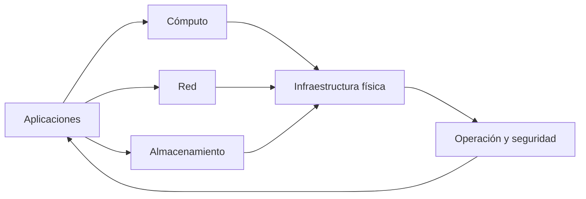

La calidad del servicio depende de la interacción entre infraestructura, software, personas y procesos.

---

# Evolución histórica

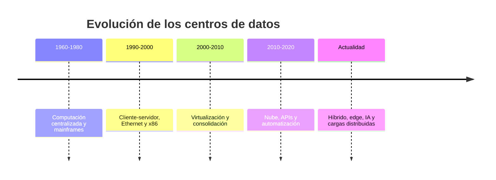

> Las etapas son un modelo didáctico: se superponen y no representan fronteras absolutas.

---

# De la centralización a la nube

| Etapa | Aporte principal | Reto frecuente |
|---|---|---|
| Mainframe | Cómputo centralizado | Costo y dependencia del sistema central |
| Cliente-servidor | Distribución de aplicaciones | Proliferación de servidores |
| Virtualización | Consolidación y movilidad | Sobreconsolidación y operación |
| Nube | Aprovisionamiento por software | Gobierno y dependencia de servicios |
| Híbrido / edge / IA | Cargas distribuidas | Latencia, energía y complejidad |

---

# Componentes del centro de datos

<div class="grid grid-cols-2 gap-4 text-left text-sm">

<div class="border rounded-lg p-3">

### Cómputo

Servidores rack, blade, hiperconvergencia, GPU, DPU y aceleradores.

</div>

<div class="border rounded-lg p-3">

### Red

Leaf, spine, firewalls, balanceadores, WAN, Internet y gestión fuera de banda.

</div>

<div class="border rounded-lg p-3">

### Almacenamiento

SAN, NAS, object storage, iSCSI, Fibre Channel y NVMe over Fabrics.

</div>

<div class="border rounded-lg p-3">

### Infraestructura física

Energía, UPS, generadores, refrigeración, racks, cableado y seguridad física.

</div>

</div>

---

# Actividad 1

## Análisis de un centro de datos

En equipos de 3 o 4 personas:

1. Seleccionen un centro de datos real o una instalación conocida.
2. Identifiquen cómputo, red, almacenamiento e infraestructura física.
3. Determinen la etapa evolutiva predominante.
4. Identifiquen dos riesgos operativos y una oportunidad de mejora.

<div class="mt-6 text-sm opacity-75">
Tiempo sugerido: 25 minutos.
</div>

---

# Cierre del bloque 1

- El centro de datos es un sistema de sistemas.
- La evolución responde a capacidad, disponibilidad, flexibilidad y costo.
- La infraestructura física y lógica debe diseñarse de forma integrada.

> **Pregunta:** ¿Qué condiciones justificarían mantener una carga en una instalación propia en vez de migrarla a nube pública?

---
layout: section
---

# Bloque 2

## Arquitecturas de red

### Duración: 1 h 30 min

---

# Arquitectura de tres capas

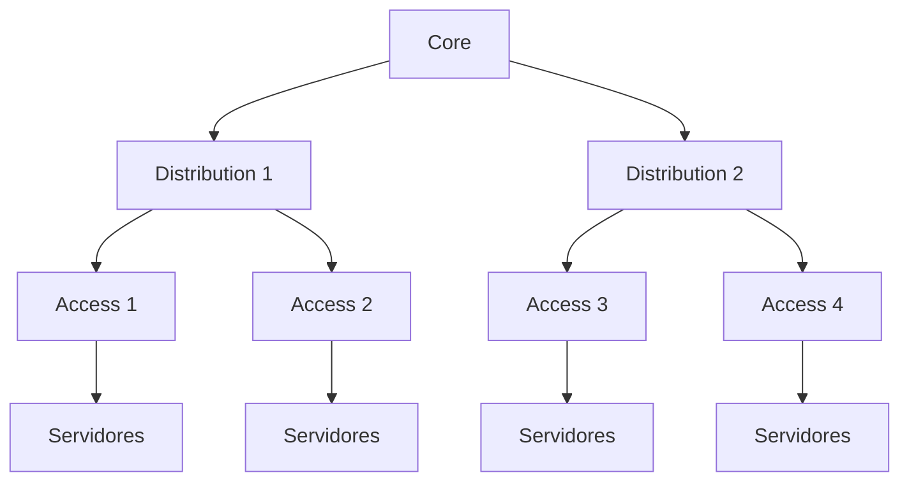

<div class="grid grid-cols-3 gap-4 mt-4 text-sm text-left">
<div><b>Acceso</b><br>Conecta equipos finales.</div>
<div><b>Distribución</b><br>Agregación, políticas y routing.</div>
<div><b>Núcleo</b><br>Conectividad de alta capacidad.</div>
</div>

---

# Arquitectura Spine–Leaf

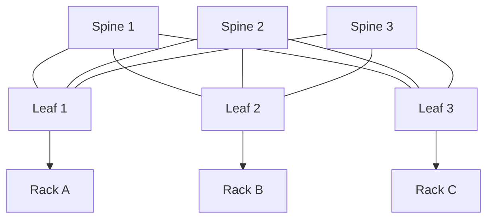

Cada leaf se conecta con cada spine en el fabric básico.

---

# Qué aporta Spine–Leaf

<div class="grid grid-cols-2 gap-5 text-left">

<div class="border rounded-lg p-4">

### Data plane

- Múltiples rutas mediante ECMP
- Caminos con número de saltos predecible
- Mejor adaptación a tráfico East–West

</div>

<div class="border rounded-lg p-4">

### Operación

- Underlay IP en capa 3
- Escalamiento horizontal condicionado por capacidad
- Menor dependencia de STP en el underlay

</div>

</div>

> No garantiza por sí mismo una red no bloqueante ni latencia constante.

---

# Tres capas y Spine–Leaf

| Criterio | Tres capas | Spine–Leaf |
|---|---|---|
| Modelo | Acceso, distribución, núcleo | Leaf y spine |
| Tráfico frecuente | North–South | East–West |
| Multipath | Depende del diseño | ECMP en underlay L3 |
| Escalabilidad | Jerárquica | Horizontal |
| Latencia | Puede variar | Saltos más predecibles |
| Uso común | Campus y redes heredadas | Fabrics de data center |

---

# Underlay y overlay

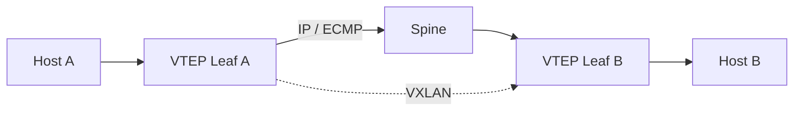

| Plano | Función |
|---|---|
| Underlay | Red IP física entre dispositivos y VTEPs |
| Overlay | Red lógica independiente de la topología física |
| VTEP | Encapsula y desencapsula tráfico VXLAN |
| EVPN | Plano de control frecuentemente basado en MP-BGP |

---

# Actividad 2

## Comparación de arquitecturas

En grupos:

1. Diseñen una arquitectura de tres capas para 100 servidores.
2. Diseñen un fabric Spine–Leaf para los mismos 100 servidores.
3. Comparen trayectorias, capacidad, escalabilidad y operación.
4. Identifiquen dos dominios de falla en cada alternativa.

<div class="mt-5 text-sm opacity-75">Tiempo sugerido: 30 minutos.</div>

---

# Cierre del bloque 2

- La arquitectura debe responder al perfil de tráfico y al crecimiento esperado.
- Spine–Leaf favorece rutas ECMP y tráfico East–West.
- Underlay y overlay separan conectividad física y segmentación lógica.

---
layout: section
---

# Bloque 3

## Capacidad y sobresuscripción

### Duración: 1 h 30 min

---

# Capacidad de un leaf

## Escenario ilustrativo

Un leaf tiene:

- 44 puertos de servidor de 25 Gb/s.
- 4 uplinks de 100 Gb/s.

$$
\text{Capacidad de servidores}
= 44 \times 25
= 1100\ \text{Gb/s}
$$

$$
\text{Capacidad de uplinks}
= 4 \times 100
= 400\ \text{Gb/s}
$$

---

# Cálculo de sobresuscripción

$$
\text{Sobresuscripción}
= \frac{\text{capacidad agregada hacia servidores}}{\text{capacidad agregada de uplinks}}
$$

## Ejemplo

$$
\text{Sobresuscripción}
= \frac{1100}{400}
= 2.75:1
$$


> La relación aceptable depende de tráfico, picos, criticidad, QoS, SLA y patrón de aplicaciones.

---

# Taller cuantitativo

<div class="grid grid-cols-2 gap-6 text-left">

<div class="border rounded-lg p-4">

### Ejercicio 1

- 32 puertos de 25 Gb/s
- 4 uplinks de 100 Gb/s

Calcule la sobresuscripción.

</div>

<div class="border rounded-lg p-4">

### Ejercicio 2

- 48 puertos de 10 Gb/s
- 4 uplinks de 40 Gb/s

Calcule la sobresuscripción.

</div>

</div>

<div class="mt-6 text-sm opacity-75">Tiempo sugerido: 20 minutos.</div>

---

# Actividad 3

## Diseño de capacidad

En grupos, propongan un diseño para 200 servidores de 25 Gb/s con conectividad dual-homed:

- Número de leafs, spines y enlaces.
- Capacidad hacia servidores y uplinks por leaf.
- Sobresuscripción esperada.
- Crecimiento máximo sin ampliar spines.
- Supuestos necesarios para evaluar tolerancia a fallas.

<div class="mt-5 text-sm opacity-75">Tiempo sugerido: 30 minutos.</div>

---

# Cierre del bloque 3

- La sobresuscripción se calcula con capacidad, no solo con puertos.
- El cálculo debe incluir velocidad, redundancia y patrón de tráfico.
- Todo diseño debe indicar sus supuestos y margen de crecimiento.

---
layout: section
---

# Bloque 4

## Estándares y disponibilidad

### Duración: 1 h 30 min

---

# Conceptos que no deben confundirse

| Concepto | Naturaleza | Finalidad |
|---|---|---|
| ANSI/TIA-942 | Estándar técnico | Infraestructura de data center |
| TIA-942 Rating | Clasificación | Niveles de infraestructura |
| Certificación TIA-942 | Evaluación | Conformidad frente a requisitos |
| Uptime Tier | Clasificación propietaria | Topología y resiliencia esperada |
| ISO/IEC 27001 | Sistema de gestión | Seguridad de información |
| ITIL | Marco de prácticas | Gestión de servicios TI |

> Los Ratings TIA-942 y los Tiers Uptime no son equivalentes automáticamente.

---

# Uptime Institute Tier Standard

| Tier | Descripción general |
|---|---|
| Tier I | Infraestructura básica |
| Tier II | Componentes redundantes |
| Tier III | Infraestructura mantenible concurrentemente |
| Tier IV | Infraestructura tolerante a fallas |

Un Tier no es una garantía de disponibilidad de extremo a extremo para una aplicación.

---

# Disponibilidad: modelo simplificado

La disponibilidad simplificada de un componente reparable es:

$$
A = \frac{MTBF}{MTBF + MTTR}
$$

> Donde:
> - MTBF: tiempo medio entre fallas.
> - MTTR: tiempo medio de reparación o recuperación.

Ejemplo: 
Con MTBF = 8.760 horas y MTTR = 4 horas:

$$
A=\frac{8760}{8760+4}=0.999543
$$

**Disponibilidad aproximada: 99,9543%.**

> El modelo no representa fallas comunes, dependencias, mantenimiento, software o errores humanos.

---

# Modelos de redundancia

| Modelo | Significado |
|---|---|
| N | Capacidad mínima para la carga |
| N+1 | Capacidad requerida más una unidad adicional |
| 2N | Dos rutas independientes, cada una con capacidad total |
| 2N+1 | Dos rutas completas más una unidad adicional |

La decisión depende del impacto al negocio, costo, mantenimiento, eficiencia y riesgo residual.

---

# Ejemplo de N+1

Una carga de **300 kW** se soporta con cuatro UPS de **100 kW**:

<div class="grid grid-cols-2 gap-6 text-left">

<div>

### Operación normal

- 4 UPS activos
- 75 kW por UPS
- Carga total: 300 kW

</div>

<div>

### Falla de un UPS

- 3 UPS restantes
- 100 kW por UPS
- Carga total soportada: 300 kW

</div>

</div>

Este es un ejemplo de capacidad **N+1**.

---

# Dominios de falla

<div class="grid grid-cols-2 gap-4 text-left text-sm">

<div class="border rounded-lg p-3"><b>Físicos</b><br>Rack, fila, sala, edificio, región.</div>
<div class="border rounded-lg p-3"><b>Eléctricos y mecánicos</b><br>PDU, UPS, circuito, generador, chiller.</div>
<div class="border rounded-lg p-3"><b>Lógicos</b><br>Switch, VTEP, DNS, controlador, clúster, VLAN/VNI.</div>
<div class="border rounded-lg p-3"><b>Operativos</b><br>Cambios, credenciales, automatización, software y error humano.</div>

</div>

> La redundancia reduce fallas individuales, pero no elimina fallas de modo común.

---

# RTO y RPO

<div class="grid grid-cols-2 gap-6 text-left">

<div class="border rounded-lg p-5">

## RTO

Tiempo máximo **objetivo** para restaurar un servicio tras una interrupción.

</div>

<div class="border rounded-lg p-5">

## RPO

Máxima pérdida de datos **aceptable**, expresada como tiempo.

</div>

</div>

<div class="mt-6 text-left">

Estos objetivos deben derivarse de un **Análisis de Impacto al Negocio (BIA)**; no de valores genéricos por tipo de aplicación.

</div>

---

# Actividad 4

## Análisis de resiliencia

En equipos:

1. Diferencien Tier III, Rated-3 y una certificación.
2. Comparen N+1 y 2N para una carga crítica.
3. Propongan RTO y RPO para pagos, ERP, portal interno y archivo histórico.
4. Justifiquen las decisiones con impacto, costo y riesgo.

<div class="mt-5 text-sm opacity-75">Tiempo sugerido: 30 minutos.</div>

---

# Cierre del bloque 4

- Un estándar, una clasificación y una certificación no son equivalentes.
- La disponibilidad depende de componentes técnicos y procesos operativos.
- RTO y RPO deben responder al impacto de negocio.

---
layout: section
---

# Bloque 5

## Direccionamiento IP y VXLAN

### Duración: 1 h 30 min

---

# Principios de direccionamiento

<v-clicks>

- Agregación de rutas y escalabilidad
- Separación por función, entorno, tenant o zona de seguridad
- Integración con DNS, DHCP, IPAM, automatización y monitoreo
- Crecimiento planificado y prevención de solapamientos
- Soporte IPv4 e IPv6 cuando sea aplicable
- Trazabilidad mediante una fuente de verdad gobernada

</v-clicks>

> Un sistema IPAM o CMDB debe registrar prefijos, VLAN/VNI, dispositivos, interfaces y asignaciones.

---

# Convenciones de host IPv4

## Ejemplo para una red `/24`

| Rango | Uso convencional posible |
|---|---|
| `.1` | Gateway virtual o interfaz de gateway |
| `.2–.9` | Infraestructura o servicios reservados |
| `.10–.49` | Servidores de aplicación |
| `.50–.99` | DHCP o asignaciones dinámicas |
| `.100–.109` | Direcciones virtuales de servicios |
| `.110–.200` | Hosts estáticos o reservas |

> La dirección de broadcast depende del prefijo; no se determina solo por el último octeto.

---

# VXLAN, VNI y VTEP

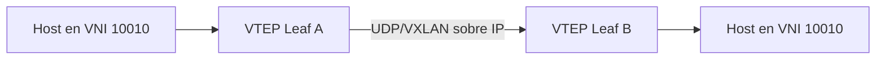

- VXLAN encapsula tráfico de segmentos lógicos sobre una red IP.
- El VNI tiene 24 bits: permite aproximadamente 16 millones de identificadores.
- EVPN puede proporcionar el plano de control para MAC, IP, VTEP y segmentos.

---

# Requisitos operativos del overlay

<div class="grid grid-cols-2 gap-5 text-left text-sm">

<div>

### Underlay

- Conectividad IP entre VTEPs
- ECMP y convergencia
- MTU suficiente para encapsulación
- Observabilidad de rutas y enlaces

</div>

<div>

### Overlay

- Segmentación mediante VNI
- Control plane EVPN cuando aplique
- Políticas de seguridad distribuidas
- Trazabilidad de MAC, IP y endpoints

</div>

</div>

---

# Actividad 5

## Plan IP e integración overlay

En grupos:

1. Propongan prefijos IPv4 e IPv6 para underlay, loopbacks y segmentos de servicio.
2. Definan rangos para gestión, web, aplicación, base de datos, respaldo y almacenamiento.
3. Identifiquen dos riesgos de solapamiento y cómo prevenirlos.
4. Expliquen qué datos deben mantenerse en IPAM.

<div class="mt-5 text-sm opacity-75">Tiempo sugerido: 30 minutos.</div>

---

# Cierre del bloque 5

- El direccionamiento debe facilitar agregación, operación y crecimiento.
- VXLAN aporta encapsulación y EVPN puede aportar control plane.
- IPAM, automatización y observabilidad son requisitos operativos.

---
layout: section
---

# Bloque 6

## Caso integrador y evaluación

### Duración: 2 h 30 min

---

# Caso integrador

## Diseño de un fabric inicial

Una organización requiere conectar **200 servidores dual-homed**.

<div class="grid grid-cols-2 gap-5 text-left text-sm mt-4">

<div class="border rounded-lg p-4">

### Requisitos

- Dos interfaces de 25 Gb/s por servidor
- Crecimiento del 30%
- Tolerancia a falla de un enlace Leaf–Spine
- Sobresuscripción máxima objetivo de 3:1

</div>

<div class="border rounded-lg p-4">

### Recursos

- Leaf: 48 × 25 Gb/s y 8 × 100 Gb/s
- Spine: 32 × 100 Gb/s
- Underlay: eBGP u OSPF
- Segmentos: gestión, web, app, BD, backup y storage

</div>

</div>

---

# Tareas de diseño I

1. Definir el número de leafs, spines y enlaces necesarios.
2. Calcular capacidad hacia servidores y uplinks por leaf.
3. Calcular la sobresuscripción por leaf.
4. Determinar el crecimiento posible sin modificar el número de spines.

> Expliciten supuestos de puertos, velocidades, dual-homing y reserva de capacidad.

---

# Tareas de diseño II

5. Proponer prefijos IPv4 e IPv6 para underlay, loopbacks y servicios.
6. Identificar dominios de falla físicos, eléctricos, lógicos y operativos.
7. Justificar EVPN multihoming, MLAG u otra opción de conectividad.
8. Definir métricas: pérdida, latencia, utilización, errores, convergencia, BGP y disponibilidad.

---

# Entregables

<div class="grid grid-cols-2 gap-x-10 text-left text-sm">

<div>

- Diagrama lógico y físico
- Tabla de puertos y capacidad
- Plan IP documentado

</div>

<div>

- Matriz de dominios de falla
- Justificación arquitectónica: máximo 1.500 palabras
- Plan de pruebas de falla y recuperación

</div>

</div>

<div class="mt-6 text-sm opacity-75">
Trabajo en clase: 60 minutos. Defensa técnica: 10–12 minutos por grupo.
</div>

---

# Rúbrica de evaluación

| Dimensión | Peso |
|---|---:|
| Corrección técnica | 25% |
| Justificación y trade-offs | 20% |
| Capacidad, escalabilidad y disponibilidad | 15% |
| Seguridad y segmentación | 15% |
| Dominios de falla y pruebas | 10% |
| Documentación y trazabilidad | 10% |
| Automatización, IPAM y observabilidad | 5% |

---

# Ideas clave

<v-clicks>

- Un centro de datos es un sistema de sistemas
- La arquitectura responde a tráfico, negocio y operación
- Spine–Leaf favorece ECMP y tráfico East–West
- VXLAN encapsula; EVPN puede controlar el overlay
- Redundancia no equivale automáticamente a disponibilidad
- IPAM, automatización y observabilidad son capacidades operativas
- Las decisiones deben declarar supuestos, riesgos y trade-offs

</v-clicks>

---

# Referencias recomendadas

<div class="text-left text-sm leading-6">

- Uptime Institute — *Tier Standard: Topology*
- ANSI/TIA-942-C — *Telecommunications Infrastructure Standard for Data Centers*
- IETF RFC 7348 — *Virtual eXtensible Local Area Network (VXLAN)*
- IETF RFC 7432 — *BGP MPLS-Based Ethernet VPN*
- ISO/IEC 22237 — *Data centre facilities and infrastructures*
- ISO/IEC 27001 — *Information security management systems*
- IETF RFC 1918 — *Address Allocation for Private Internets*
- IETF RFC 4193 — *Unique Local IPv6 Unicast Addresses*

</div>

---
layout: end
---

# Pregunta de discusión

¿Qué arquitectura propondría para una organización con:

- Tráfico East–West predominante
- Crecimiento esperado del 50%
- Disponibilidad crítica
- Presupuesto limitado
- Equipo operativo pequeño

<div class="mt-8 text-sm opacity-70">
Universidad Nacional de Colombia · Redes de Datos · Unidad 1
</div>


---
theme: default
title: Unidad 2 — Implementación de Redes para Data Center
info: |
  Redes de Datos
  Especialización en Gestión de Redes de Datos
  Universidad Nacional de Colombia
author: Universidad Nacional de Colombia
date: 2026
class: text-center
highlighter: shiki
lineNumbers: false
mdc: true
---

# Unidad 2

## Implementación de Redes para Data Center

### Redes de Datos

**Especialización en Gestión de Redes de Datos**

Universidad Nacional de Colombia


---
layout: intro
---

# Propósito de la unidad

Implementar una red de data center exige integrar:

<div class="grid grid-cols-2 gap-5 text-left">

<div class="border rounded-lg p-4">

### Plano de datos

- Ethernet, IP y routing
- Switching y capacidad
- Buffers y congestión
- ECMP y forwarding

</div>

<div class="border rounded-lg p-4">

### Control y operación

- VLAN, VXLAN y EVPN
- Redundancia y BFD
- Seguridad y segmentación
- Observabilidad y automatización

</div>

</div>

> Las configuraciones de esta unidad usan sintaxis **FRRouting/Linux de referencia**. Deben adaptarse a la plataforma institucional.

---

# Resultados de aprendizaje

Al finalizar la unidad, el estudiante podrá:

<v-clicks>

- Diferenciar LAN de data center y LAN de campus
- Calcular capacidad full-duplex y sobresuscripción
- Configurar VLAN, trunking y LACP
- Construir un underlay IP con eBGP
- Configurar VXLAN, VTEP, VNI y EVPN básico
- Implementar gateway distribuido según plataforma
- Comparar MLAG y EVPN multihoming
- Configurar BFD y medir convergencia

</v-clicks>

---

# Topología de referencia

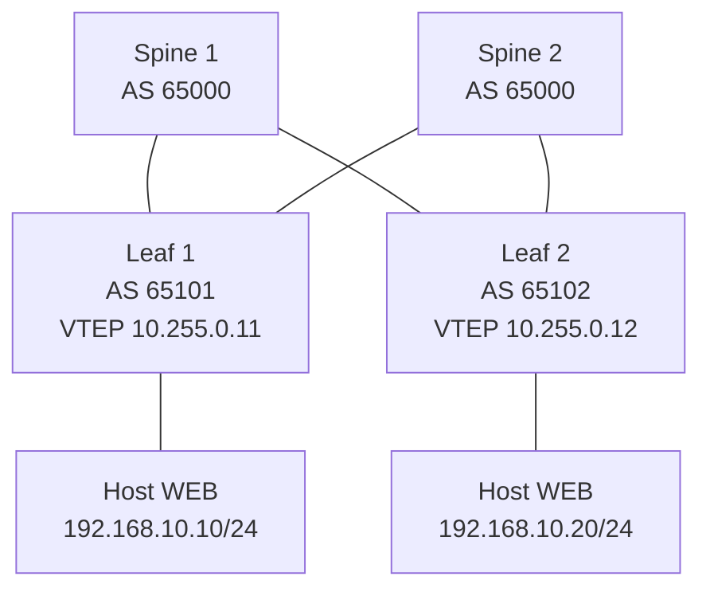

- Underlay: enlaces IP punto a punto y eBGP.
- Overlay: VXLAN con EVPN.
- VNI 10010: segmento WEB.
- VNI 10020: segmento APP.

---

# Plan de direccionamiento

| Elemento | Dirección / prefijo | Uso |
|---|---|---|
| Spine 1 loopback | 10.255.0.1/32 | Router-ID y BGP EVPN |
| Spine 2 loopback | 10.255.0.2/32 | Router-ID y BGP EVPN |
| Leaf 1 loopback | 10.255.0.11/32 | VTEP y Router-ID |
| Leaf 2 loopback | 10.255.0.12/32 | VTEP y Router-ID |
| S1–L1 | 10.0.0.0/31 | Underlay |
| S1–L2 | 10.0.0.2/31 | Underlay |
| S2–L1 | 10.0.0.4/31 | Underlay |
| S2–L2 | 10.0.0.6/31 | Underlay |
| VLAN 10 / VNI 10010 | 192.168.10.0/24 | WEB |
| VLAN 20 / VNI 10020 | 192.168.20.0/24 | APP |

> En producción, los prefijos deben proceder de IPAM y permitir agregación, reservas y crecimiento.

---
layout: section
---

# Bloque 1

## LAN, switching y capacidad

---

# Tráfico en el data center

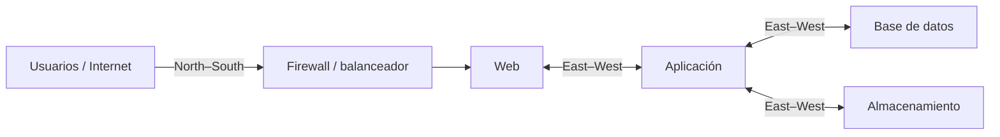

- **North–South:** flujos entre usuarios, WAN, Internet y servicios internos.
- **East–West:** comunicación entre workloads, servicios y almacenamiento.

> El diseño debe basarse en tráfico medido o estimado, no en una suposición de que East–West siempre predomina.

---

# Capacidad full-duplex

Un leaf posee 48 puertos de acceso de 25 Gb/s:

\[
48\times25\times2=2400\ \text{Gb/s}=2.4\ \text{Tb/s}
\]

Si dispone de 6 uplinks de 100 Gb/s:

\[
6\times100\times2=1200\ \text{Gb/s}=1.2\ \text{Tb/s}
\]

---

# Sobresuscripción

Para calcular sobresuscripción se compara capacidad agregada de acceso contra capacidad agregada de uplinks:

\[
\text{Oversubscription}=\frac{48\times25}{6\times100}=2:1
\]

Una relación 2:1 no es automáticamente incorrecta. Debe evaluarse frente a picos, aplicaciones, SLA, buffers, QoS y capacidad posterior a falla.

---

# Congestión: conceptos operativos

<div class="grid grid-cols-2 gap-5 text-left text-sm">

<div class="border rounded-lg p-4">

### Causas frecuentes

- Incast
- Microbursts
- Salidas contenciosas
- Uplinks saturados
- Hash ECMP desigual

</div>

<div class="border rounded-lg p-4">

### Evidencia a revisar

- Drops y discards
- Ocupación de colas
- Utilización por interfaz
- ECN marks
- Errores físicos y FCS

</div>

</div>

---

# ECN, DCTCP y PFC

| Mecanismo | Propósito | Precaución |
|---|---|---|
| ECN | Señalizar congestión | Requiere soporte end-to-end |
| DCTCP | Ajustar TCP con ECN | Requiere hosts compatibles |
| PFC | Pausar por prioridad | Riesgo de deadlock y congestión propagada |
| 802.3x PAUSE | Pausar enlace completo | Puede bloquear tráfico no relacionado |

> PFC debe habilitarse únicamente en clases de tráfico justificadas y tras validación de extremo a extremo.

---
layout: section
---

# Bloque 2

## VLAN, trunks y LACP

---

# VLAN y segmentación

Una VLAN es un dominio lógico de capa 2. IEEE 802.1Q incluye un VID de 12 bits; los valores operativos convencionales son 1 a 4094.

<div class="grid grid-cols-2 gap-5 text-left text-sm mt-5">

<div>

### Aporta

- Separación de broadcast
- Organización lógica
- Asociación con políticas

</div>

<div>

### No sustituye

- VRF y routing segmentado
- Firewalls y ACL
- Gestión de identidad
- Análisis de dominios de falla

</div>

</div>

---

# Linux: creación de VLAN

```bash
# Crear VLAN 10 sobre la interfaz de acceso/trunk eth1
ip link add link eth1 name eth1.10 type vlan id 10
ip link set eth1.10 up

# Asignar dirección de gateway o gestión, si corresponde
ip address add 192.168.10.1/24 dev eth1.10
```

Verificación:

```bash
ip -d link show eth1.10
ip address show dev eth1.10
bridge vlan show
```

> En un switch, la sintaxis depende de NOS. En Linux, el bridge o switch virtual debe transportar la VLAN según el diseño.

---

# Trunk 802.1Q: modelo conceptual

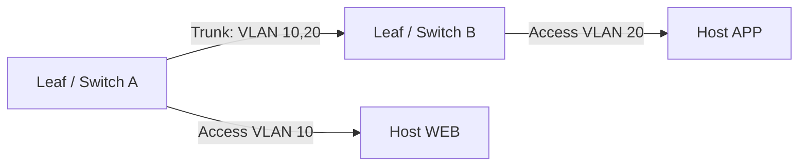

Un trunk transporta varias VLAN etiquetadas. En enlaces hacia hosts, normalmente se usa una VLAN de acceso; hipervisores y appliances pueden requerir trunking.

---

# Linux bonding con LACP

```bash
# Crear una interfaz bond en modo 802.3ad
ip link add bond0 type bond mode 802.3ad miimon 100 lacp_rate fast
ip link set eth1 down
ip link set eth2 down
ip link set eth1 master bond0
ip link set eth2 master bond0
ip link set eth1 up
ip link set eth2 up
ip link set bond0 up
```

Verificación:

```bash
cat /proc/net/bonding/bond0
ip link show bond0
```

> El switch debe configurar un LAG compatible. Un flujo individual puede quedar limitado a un miembro según el algoritmo de hashing.

---

# LACP, MLAG y EVPN multihoming

| Tecnología | Función | Consideraciones |
|---|---|---|
| LACP | Agrega enlaces a un sistema lógico | Distribución basada en hashing |
| MLAG / vPC | Conecta endpoint a dos switches físicos | Peer-link, sincronización y split-brain |
| EVPN multihoming | Coordina endpoints multihomed mediante ESI | Depende de estándar, NOS y diseño |

EVPN multihoming puede coexistir con LACP hacia el endpoint. La configuración exacta debe verificarse en la documentación del fabricante.

---
layout: section
---

# Bloque 3

## Underlay IP con eBGP

---

# Principios del underlay

El underlay debe proporcionar reachability IP confiable entre loopbacks VTEP.

- Enlaces punto a punto Layer 3.
- Direcciones /31 para IPv4 o /127 para IPv6 cuando la plataforma lo permita.
- ECMP entre leafs y spines.
- BGP, OSPF o IS-IS como protocolo de routing.
- MTU suficiente para encapsulación VXLAN.

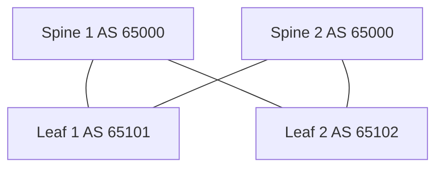

---

# Interfaces: Leaf 1

```bash
# Linux: direcciones underlay y loopback de VTEP
ip address add 10.255.0.11/32 dev lo
ip link set lo up

ip address add 10.0.0.1/31 dev eth1   # hacia Spine 1
ip address add 10.0.0.5/31 dev eth2   # hacia Spine 2
ip link set eth1 up
ip link set eth2 up
```

| Interfaz | Dirección | Vecino |
|---|---|---|
| lo | 10.255.0.11/32 | VTEP Leaf 1 |
| eth1 | 10.0.0.1/31 | Spine 1: 10.0.0.0 |
| eth2 | 10.0.0.5/31 | Spine 2: 10.0.0.4 |

---

# FRRouting: Leaf 1 eBGP underlay

```frr
router bgp 65101
 bgp router-id 10.255.0.11
 no bgp ebgp-requires-policy
 neighbor 10.0.0.0 remote-as 65000
 neighbor 10.0.0.4 remote-as 65000

 address-family ipv4 unicast
  network 10.255.0.11/32
 exit-address-family
```

> En un diseño con dos spines en el mismo AS, cada leaf establece sesiones eBGP con ambos spines. En producción, use políticas explícitas en lugar de `no bgp ebgp-requires-policy`.

---

# FRRouting: Spine 1 eBGP underlay

```frr
router bgp 65000
 bgp router-id 10.255.0.1
 no bgp ebgp-requires-policy
 neighbor 10.0.0.1 remote-as 65101
 neighbor 10.0.0.2 remote-as 65102

 address-family ipv4 unicast
 exit-address-family
```

Verificación:

```bash
vtysh -c 'show bgp ipv4 unicast summary'
vtysh -c 'show ip route'
ping -I 10.255.0.11 10.255.0.12
```

---

# ECMP en el underlay

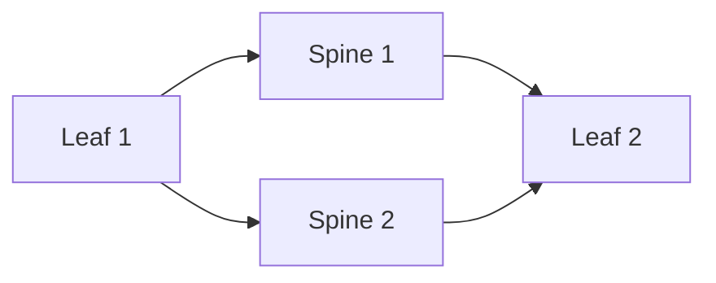

Para obtener ECMP se requieren rutas de costo equivalente y soporte del plano de forwarding. Verifique los next hops instalados, no solo la existencia de vecinos BGP.

```bash
vtysh -c 'show ip route 10.255.0.12/32'
traceroute -s 10.255.0.11 10.255.0.12
```

---

# Underlay: pruebas esenciales

1. Verifique estado `Established` de todas las sesiones BGP.
2. Verifique reachability entre todas las loopbacks VTEP.
3. Confirme rutas ECMP a VTEPs remotos.
4. Valide MTU entre leafs antes de activar VXLAN.
5. Induzca la falla de un enlace Leaf–Spine y observe rutas y pérdida.

---
layout: section
---

# Bloque 4

## VXLAN y EVPN

---

# Encapsulación VXLAN

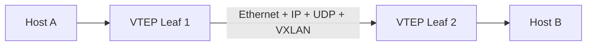

VXLAN encapsula un frame Ethernet dentro de UDP/IP. El VNI identifica el segmento virtual.

| Campo | Tamaño típico |
|---|---:|
| Ethernet externo | 14 bytes |
| IPv4 externo | 20 bytes |
| UDP | 8 bytes |
| VXLAN | 8 bytes |

> Debe presupuestarse overhead adicional para VLAN externas, IPv6, opciones y encapsulaciones adicionales.

---

# Linux: crear bridge y VNI VXLAN

```bash
# Bridge para VLAN/VNI WEB
ip link add br-web type bridge vlan_filtering 1
ip link set br-web up

# Interfaz VXLAN: VNI 10010, VTEP local Leaf 1
ip link add vxlan10010 type vxlan id 10010 \
  local 10.255.0.11 dstport 4789 nolearning
ip link set vxlan10010 master br-web
ip link set vxlan10010 up

# Puerto de host en la bridge
ip link set eth3 master br-web
ip link set eth3 up
```

> `nolearning` es habitual cuando EVPN controla el aprendizaje. La configuración de FDB remota depende de la integración EVPN y de la plataforma.

---

# Linux: VNI APP y gateway local

```bash
# Segundo segmento VXLAN para APP
ip link add br-app type bridge vlan_filtering 1
ip link set br-app up

ip link add vxlan10020 type vxlan id 10020 \
  local 10.255.0.11 dstport 4789 nolearning
ip link set vxlan10020 master br-app
ip link set vxlan10020 up

# Ejemplo de interfaz L3 para un gateway local de laboratorio
ip address add 192.168.20.1/24 dev br-app
```

> Un Anycast Gateway real requiere la misma identidad de gateway en todos los leafs participantes y una implementación EVPN coherente. No se logra únicamente asignando una IP a una bridge Linux.

---

# FRRouting: habilitar EVPN en Leaf 1

```frr
router bgp 65101
 bgp router-id 10.255.0.11
 no bgp ebgp-requires-policy

 neighbor 10.0.0.0 remote-as 65000
 neighbor 10.0.0.4 remote-as 65000

 address-family l2vpn evpn
  neighbor 10.0.0.0 activate
  neighbor 10.0.0.4 activate
  advertise-all-vni
 exit-address-family
```

Los spines pueden actuar como route reflectors EVPN o como transit peers, según el diseño BGP elegido. La topología de control plane debe definirse explícitamente.

---

# FRRouting: Spine como EVPN route reflector

```frr
router bgp 65000
 bgp router-id 10.255.0.1
 no bgp ebgp-requires-policy

 neighbor 10.0.0.1 remote-as 65101
 neighbor 10.0.0.2 remote-as 65102

 address-family l2vpn evpn
  neighbor 10.0.0.1 activate
  neighbor 10.0.0.1 route-reflector-client
  neighbor 10.0.0.2 activate
  neighbor 10.0.0.2 route-reflector-client
 exit-address-family
```

> Route reflection, ASN, next-hop handling y políticas dependen del diseño. En producción, aplique filtros y políticas explícitas.

---

# Rutas EVPN relevantes

| Ruta | Uso |
|---:|---|
| Tipo 1 | Ethernet Auto-Discovery y multihoming |
| Tipo 2 | MAC/IP Advertisement para endpoints |
| Tipo 3 | Inclusive Multicast Ethernet Tag para BUM |
| Tipo 4 | Ethernet Segment y elección DF |
| Tipo 5 | IP Prefix para prefijos IP y routing distribuido |

- RFC 7432 define las rutas Tipo 1 a 4.
- RFC 9136 define la ruta Tipo 5.
- VXLAN aporta encapsulación; EVPN aporta un plano de control basado en BGP.

---

# Verificación VXLAN y EVPN

```bash
# Linux
ip -d link show type vxlan
bridge fdb show
bridge vlan show
ip neigh show

# FRRouting
vtysh -c 'show bgp l2vpn evpn summary'
vtysh -c 'show bgp l2vpn evpn route'
vtysh -c 'show evpn vni'

# Captura de encapsulación VXLAN
sudo tcpdump -ni eth1 udp port 4789
```

Verifique VTEPs, VNIs, rutas EVPN, MAC/IP aprendidas, FDB y tráfico UDP/4789 en el underlay.

---

# BUM y distribución

EVPN reduce la dependencia del aprendizaje por inundación, pero no elimina automáticamente todo tráfico BUM.

<div class="grid grid-cols-2 gap-5 text-left text-sm">

<div>

### BUM

- Broadcast
- Unknown unicast
- Multicast

</div>

<div>

### Opciones frecuentes

- Ingress replication
- Multicast en underlay
- Optimización del fabricante

</div>

</div>

> Seleccione el modelo según escala, requisitos multicast, hardware, operación y capacidad de replicación.

---

# Anycast Gateway: principio

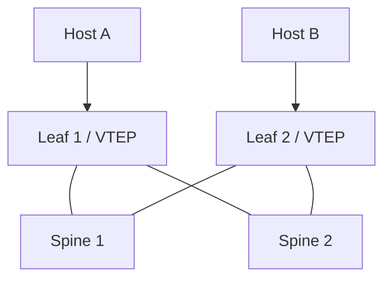

Cada leaf participante presenta la misma identidad de gateway para una subred. El host usa el leaf local para routing hacia otros segmentos, reduciendo trayectos innecesarios.

---

# Anycast Gateway: requisitos

Un gateway distribuido requiere, según plataforma:

- Misma IP de gateway en leafs participantes.
- Misma MAC virtual o anycast MAC cuando sea aplicable.
- VNIs y VRFs consistentes.
- Control plane EVPN funcional.
- Políticas de seguridad y routing coherentes.
- Verificación de ARP/ND, MAC mobility y rutas Tipo 2/Tipo 5.

> VRRP y HSRP son mecanismos de gateway redundante tradicionales; Anycast Gateway es una función distribuida frecuente en fabrics VXLAN-EVPN.

---
layout: section
---

# Bloque 5

## BFD, fallas y convergencia

---

# BFD: detección de fallas

BFD detecta fallas de forwarding bidireccional entre sistemas. Puede complementar BGP, OSPF o IS-IS.

\[
T_{detección}\approx\text{intervalo efectivo}\times\text{detect multiplier}
\]

Ejemplo ilustrativo:

\[
50\ \text{ms}\times3\approx150\ \text{ms}
\]

> BFD acelera detección; no garantiza por sí solo la convergencia extremo a extremo de la aplicación.

---

# FRRouting: BFD sobre vecino BGP

```frr
bfd
 profile DC-FAST
  transmit-interval 50
  receive-interval 50
  detect-multiplier 3
 !

router bgp 65101
 neighbor 10.0.0.0 bfd profile DC-FAST
 neighbor 10.0.0.4 bfd profile DC-FAST
```

Verificación:

```bash
vtysh -c 'show bfd peers'
vtysh -c 'show bgp ipv4 unicast neighbors 10.0.0.0'
```

> La sintaxis puede variar por versión de FRRouting. En entornos reales, valide soporte de hardware y evite temporizadores agresivos sin pruebas de estabilidad.

---

# Detección no equivale a convergencia

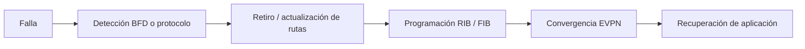

La medición debe incluir detección, control plane, forwarding, pérdida de paquetes y comportamiento del servicio.

---

# Prueba reproducible de falla

1. Genere tráfico continuo entre dos hosts: ICMP, TCP o UDP.
2. Registre BGP, EVPN, FIB, BFD, errores y utilización inicial.
3. Deshabilite un enlace Leaf–Spine o una interfaz de prueba.
4. Registre pérdida, latencia, cambios de rutas y tiempo de recuperación.
5. Repita el ensayo con y sin BFD.
6. Evalúe capacidad remanente y posible congestión tras la falla.

```bash
# Ejemplo de tráfico continuo
ping -D -i 0.05 192.168.10.20

# Monitoreo de BGP y BFD
watch -n 1 "vtysh -c 'show bgp ipv4 unicast summary'"
watch -n 1 "vtysh -c 'show bfd peers'"
```

---

# Criterios de aceptación

| Dimensión | Evidencia |
|---|---|
| Control plane | Sesiones BGP/EVPN y BFD en estado esperado |
| Data plane | Rutas ECMP y FIB actualizadas |
| Rendimiento | Pérdida, latencia, jitter y throughput medidos |
| Capacidad | Sin congestión inaceptable tras una falla |
| Operación | Alertas, logs y telemetría verificables |
| Reversión | Recuperación controlada del componente fallado |

---
layout: section
---

# Bloque 6

## Laboratorio y caso integrador

---

# Laboratorio técnico

## VXLAN-EVPN básico

### Recursos mínimos

- 2 spines y 2 leafs virtuales.
- FRRouting y Linux bridge/VXLAN, o NOS equivalente.
- 2 hosts de prueba en leafs distintos.
- Underlay IPv4 /31 y loopbacks /32.
- VLAN 10 / VNI 10010 para WEB.

### Secuencia

1. Configure interfaces y loopbacks.
2. Configure eBGP underlay y verifique ECMP.
3. Configure VTEP y VNI en cada leaf.
4. Habilite EVPN y verifique rutas.
5. Conecte hosts al mismo VNI y pruebe conectividad.
6. Capture UDP/4789 en enlaces underlay.
7. Induzca una falla Leaf–Spine y mida recuperación.

---

# Comandos de verificación

```bash
# Underlay
vtysh -c 'show bgp ipv4 unicast summary'
vtysh -c 'show ip route'
ping -I 10.255.0.11 10.255.0.12

# EVPN / VXLAN
vtysh -c 'show bgp l2vpn evpn summary'
vtysh -c 'show bgp l2vpn evpn route'
vtysh -c 'show evpn vni'
ip -d link show type vxlan
bridge fdb show

# Tráfico y MTU
ping -M do -s 1400 192.168.10.20
sudo tcpdump -ni eth1 udp port 4789
```

---

# Troubleshooting sistemático

| Síntoma | Hipótesis inicial | Verificación |
|---|---|---|
| No hay reachability VTEP | Underlay o BGP incompleto | BGP summary, rutas y ping de loopback |
| No aparece MAC remota | EVPN/VNI/FDB inconsistente | Rutas Tipo 2, FDB, bridge y VTEP |
| Ping falla con paquetes grandes | MTU insuficiente | `ping -M do`, MTU interfaces y counters |
| Pérdida tras una falla | ECMP/BFD/FIB o capacidad insuficiente | Rutas, BFD, drops y utilización |
| Un flujo no usa todo LAG | Hashing por flujo | Estado LACP y campos de hash |

---

# Caso integrador

## Fabric para 200 servidores dual-homed

**Requisitos:**

- Dos interfaces de 25 Gb/s por servidor.
- Crecimiento del 30%.
- Tolerancia a falla de un enlace Leaf–Spine.
- Sobresuscripción máxima objetivo de 3:1.
- Segmentos: gestión, web, aplicación, base de datos, respaldo y almacenamiento.

**Equipamiento:**

- Leaf: 48 × 25 Gb/s y 8 × 100 Gb/s.
- Spine: 32 × 100 Gb/s.
- Underlay: eBGP, OSPF o IS-IS.
- Overlay: VXLAN-EVPN.

---

# Entregables del caso

1. Diagrama físico y lógico.
2. Supuestos de dual-homing y reserva de puertos.
3. Cálculos de capacidad y sobresuscripción, normal y post-falla.
4. Plan IPv4/IPv6: underlay, loopbacks, VRF y servicios.
5. Tabla de VLAN, VNI, VRF y políticas de seguridad.
6. Justificación de MLAG, EVPN multihoming u otra alternativa.
7. Diseño de gateway distribuido y BFD.
8. Matriz de dominios de falla.
9. Plan de pruebas, aceptación, reversión y observabilidad.
10. Informe técnico de máximo 1.500 palabras.

---

# Rúbrica de evaluación

| Criterio | Peso |
|---|---:|
| Corrección técnica | 25% |
| Justificación arquitectónica y trade-offs | 20% |
| Capacidad y análisis posterior a falla | 15% |
| Segmentación y seguridad | 15% |
| Configuración, verificación y troubleshooting | 10% |
| Documentación, diagramas y trazabilidad | 10% |
| Observabilidad y automatización | 5% |

---

# Ideas clave

<v-clicks>

- El underlay IP debe ser simple, enrutable y observable
- VXLAN encapsula; EVPN distribuye información de control
- La configuración depende de la plataforma y debe validarse
- ECMP y BFD contribuyen a resiliencia, pero deben medirse
- MLAG, LACP y EVPN multihoming tienen implicaciones distintas
- MTU, FDB, rutas EVPN y BGP son puntos esenciales de troubleshooting
- Una red resiliente se demuestra con pruebas de falla reproducibles

</v-clicks>

---

# Referencias técnicas

<div class="text-left text-sm leading-6">

- IETF RFC 7348 — *Virtual eXtensible Local Area Network (VXLAN)*
- IETF RFC 7432 — *BGP MPLS-Based Ethernet VPN*
- IETF RFC 9135 — *Integrated Routing and Bridging in EVPN*
- IETF RFC 9136 — *IP Prefix Advertisement in EVPN*
- IETF RFC 5880 — *Bidirectional Forwarding Detection*
- IEEE 802.1Q — *Bridges and Bridged Networks*
- IEEE 802.1AX — *Link Aggregation*
- IEEE 802.1Qbb — *Priority-based Flow Control*
- FRRouting — documentación de BGP, EVPN, VXLAN y BFD

</div>

---
layout: end
---

# Pregunta de cierre

¿Cómo diseñaría una estrategia de implementación gradual desde una red VLAN/MLAG heredada hacia una fabric VXLAN-EVPN, minimizando riesgo operativo y manteniendo la continuidad de los servicios?

<div class="mt-8 text-sm opacity-70">
Universidad Nacional de Colombia · Redes de Datos · Unidad 2
</div>