# Unidad 1

## Fundamentos y Diseño de Data Center

### Redes de Datos

**Especialización en Gestión de Redes de Datos**

Universidad Nacional de Colombia

Duración total: 10 horas

---
layout: intro
---

# Estructura de la Unidad

| Bloque | Duración | Tema |
|---|---:|---|
| 1 | 1 h 30 min | Evolución y componentes |
| 2 | 1 h 30 min | Arquitecturas de red |
| 3 | 1 h 30 min | Capacidad y sobresuscripción |
| 4 | 1 h 30 min | Estándares y disponibilidad |
| 5 | 1 h 30 min | Direccionamiento IP y VXLAN |
| 6 | 2 h 30 min | Caso integrador y evaluación |

> **Total:** 10 horas de trabajo académico.

---

# Resultados de aprendizaje

Al finalizar la unidad, el estudiante podrá:

<v-clicks>

- Explicar la evolución de los centros de datos
- Diferenciar cómputo, red, almacenamiento e infraestructura física
- Comparar arquitecturas de tres capas y Spine–Leaf
- Calcular sobresuscripción y disponibilidad con supuestos explícitos
- Distinguir estándares, clasificaciones y certificaciones
- Identificar dominios de falla y fallas de modo común
- Diseñar un direccionamiento IP escalable
- Explicar underlay, overlay, VXLAN, VTEP y EVPN

</v-clicks>

---

# Metodología de trabajo

### Análisis

- Exposición guiada
- Discusión crítica
- Casos reales

### Diseño

- Talleres cuantitativos
- Diseño de arquitecturas
- Trabajo colaborativo

### Validación

- Actividades prácticas
- Defensa técnica
- Retroalimentación

### Criterio central

Cada decisión debe justificar sus supuestos, riesgos y *trade-offs*.

---

# Evaluación de la unidad

- Corrección técnica: **25%**
- Justificación arquitectónica: **20%**
- Capacidad, escalabilidad y disponibilidad: **15%**
- Seguridad y segmentación: **15%**

- Dominios de falla y pruebas: **10%**
- Documentación y trazabilidad: **10%**
- Automatización, IPAM y observabilidad: **5%**

---
layout: section
---

# Bloque 1

## Evolución y componentes

### Duración: 1 h 30 min

---

# El centro de datos como sistema

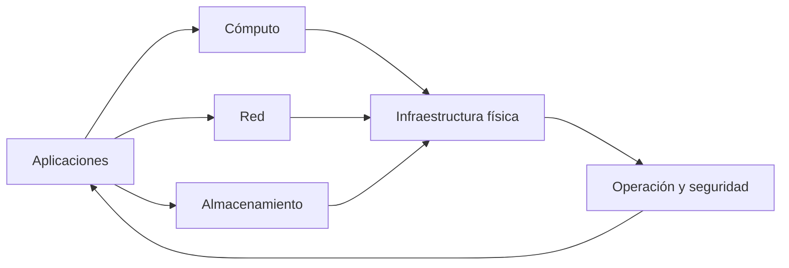

La calidad del servicio depende de la interacción entre infraestructura, software, personas y procesos.

---

# Evolución histórica

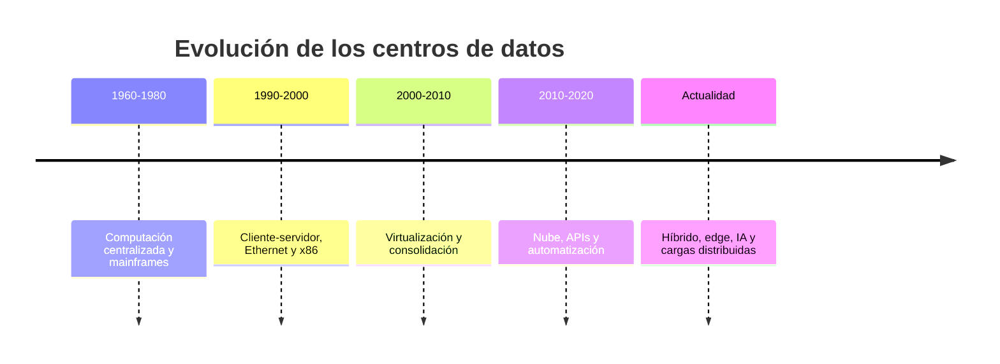

> Las etapas son un modelo didáctico: se superponen y no representan fronteras absolutas.

---

# De la centralización a la nube

| Etapa | Aporte principal | Reto frecuente |
|---|---|---|
| Mainframe | Cómputo centralizado | Costo y dependencia del sistema central |
| Cliente-servidor | Distribución de aplicaciones | Proliferación de servidores |
| Virtualización | Consolidación y movilidad | Sobreconsolidación y operación |
| Nube | Aprovisionamiento por software | Gobierno y dependencia de servicios |
| Híbrido / edge / IA | Cargas distribuidas | Latencia, energía y complejidad |

---

# Componentes del centro de datos

### Cómputo

Servidores rack, blade, hiperconvergencia, GPU, DPU y aceleradores.

### Red

Leaf, spine, firewalls, balanceadores, WAN, Internet y gestión fuera de banda.

### Almacenamiento

SAN, NAS, object storage, iSCSI, Fibre Channel y NVMe over Fabrics.

### Infraestructura física

Energía, UPS, generadores, refrigeración, racks, cableado y seguridad física.

---

# Actividad 1

## Análisis de un centro de datos

En equipos de 3 o 4 personas:

1. Seleccionen un centro de datos real o una instalación conocida.
2. Identifiquen cómputo, red, almacenamiento e infraestructura física.
3. Determinen la etapa evolutiva predominante.
4. Identifiquen dos riesgos operativos y una oportunidad de mejora.

Tiempo sugerido: 25 minutos.

---

# Cierre del bloque 1

- El centro de datos es un sistema de sistemas.
- La evolución responde a capacidad, disponibilidad, flexibilidad y costo.
- La infraestructura física y lógica debe diseñarse de forma integrada.

> **Pregunta:** ¿Qué condiciones justificarían mantener una carga en una instalación propia en vez de migrarla a nube pública?

---
layout: section
---

# Bloque 2

## Arquitecturas de red

### Duración: 1 h 30 min

---

# Arquitectura de tres capas

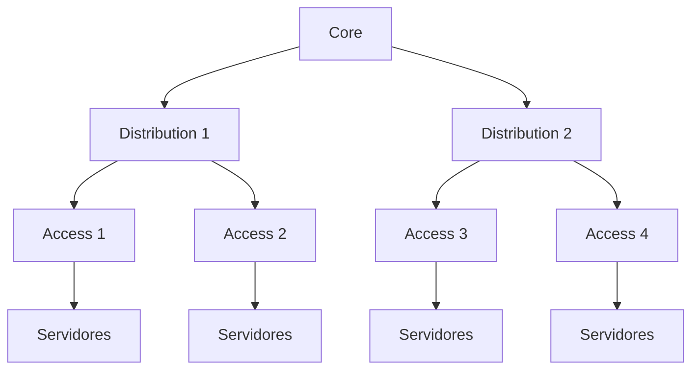

<b>Acceso</b> Conecta equipos finales.

<b>Distribución</b> Agregación, políticas y routing.

<b>Núcleo</b> Conectividad de alta capacidad.

---

# Arquitectura Spine–Leaf

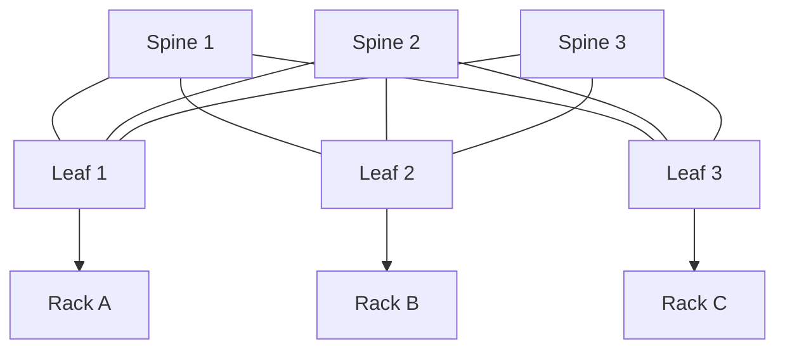

Cada leaf se conecta con cada spine en el fabric básico.

---

# Qué aporta Spine–Leaf

### Data plane

- Múltiples rutas mediante ECMP
- Caminos con número de saltos predecible
- Mejor adaptación a tráfico East–West

### Operación

- Underlay IP en capa 3
- Escalamiento horizontal condicionado por capacidad
- Menor dependencia de STP en el underlay

> No garantiza por sí mismo una red no bloqueante ni latencia constante.

---

# Tres capas y Spine–Leaf

| Criterio | Tres capas | Spine–Leaf |
|---|---|---|
| Modelo | Acceso, distribución, núcleo | Leaf y spine |
| Tráfico frecuente | North–South | East–West |
| Multipath | Depende del diseño | ECMP en underlay L3 |
| Escalabilidad | Jerárquica | Horizontal |
| Latencia | Puede variar | Saltos más predecibles |
| Uso común | Campus y redes heredadas | Fabrics de data center |

---

# Underlay y overlay

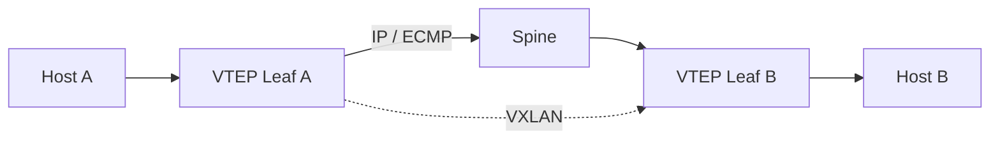

| Plano | Función |
|---|---|
| Underlay | Red IP física entre dispositivos y VTEPs |
| Overlay | Red lógica independiente de la topología física |
| VTEP | Encapsula y desencapsula tráfico VXLAN |
| EVPN | Plano de control frecuentemente basado en MP-BGP |

---

# Actividad 2

## Comparación de arquitecturas

En grupos:

1. Diseñen una arquitectura de tres capas para 100 servidores.
2. Diseñen un fabric Spine–Leaf para los mismos 100 servidores.
3. Comparen trayectorias, capacidad, escalabilidad y operación.
4. Identifiquen dos dominios de falla en cada alternativa.

Tiempo sugerido: 30 minutos.

---

# Cierre del bloque 2

- La arquitectura debe responder al perfil de tráfico y al crecimiento esperado.
- Spine–Leaf favorece rutas ECMP y tráfico East–West.
- Underlay y overlay separan conectividad física y segmentación lógica.

---
layout: section
---

# Bloque 3

## Capacidad y sobresuscripción

### Duración: 1 h 30 min

---

# Capacidad de un leaf

## Escenario ilustrativo

Un leaf tiene:

- 44 puertos de servidor de 25 Gb/s.
- 4 uplinks de 100 Gb/s.

$$
\text{Capacidad de servidores}
= 44 \times 25
= 1100\ \text{Gb/s}
$$

$$
\text{Capacidad de uplinks}
= 4 \times 100
= 400\ \text{Gb/s}
$$

---

# Cálculo de sobresuscripción

$$
\text{Sobresuscripción}
= \frac{\text{capacidad agregada hacia servidores}}{\text{capacidad agregada de uplinks}}
$$

## Ejemplo

$$
\text{Sobresuscripción}
= \frac{1100}{400}
= 2.75:1
$$

> La relación aceptable depende de tráfico, picos, criticidad, QoS, SLA y patrón de aplicaciones.

---

# Taller cuantitativo

### Ejercicio 1

- 32 puertos de 25 Gb/s
- 4 uplinks de 100 Gb/s

Calcule la sobresuscripción.

### Ejercicio 2

- 48 puertos de 10 Gb/s
- 4 uplinks de 40 Gb/s

Calcule la sobresuscripción.

Tiempo sugerido: 20 minutos.

---

# Actividad 3

## Diseño de capacidad

En grupos, propongan un diseño para 200 servidores de 25 Gb/s con conectividad dual-homed:

- Número de leafs, spines y enlaces.
- Capacidad hacia servidores y uplinks por leaf.
- Sobresuscripción esperada.
- Crecimiento máximo sin ampliar spines.
- Supuestos necesarios para evaluar tolerancia a fallas.

Tiempo sugerido: 30 minutos.

---

# Cierre del bloque 3

- La sobresuscripción se calcula con capacidad, no solo con puertos.
- El cálculo debe incluir velocidad, redundancia y patrón de tráfico.
- Todo diseño debe indicar sus supuestos y margen de crecimiento.

---
layout: section
---

# Bloque 4

## Estándares y disponibilidad

### Duración: 1 h 30 min

---

# Conceptos que no deben confundirse

| Concepto | Naturaleza | Finalidad |
|---|---|---|
| ANSI/TIA-942 | Estándar técnico | Infraestructura de data center |
| TIA-942 Rating | Clasificación | Niveles de infraestructura |
| Certificación TIA-942 | Evaluación | Conformidad frente a requisitos |
| Uptime Tier | Clasificación propietaria | Topología y resiliencia esperada |
| ISO/IEC 27001 | Sistema de gestión | Seguridad de información |
| ITIL | Marco de prácticas | Gestión de servicios TI |

> Los Ratings TIA-942 y los Tiers Uptime no son equivalentes automáticamente.

---

# Uptime Institute Tier Standard

| Tier | Descripción general |
|---|---|
| Tier I | Infraestructura básica |
| Tier II | Componentes redundantes |
| Tier III | Infraestructura mantenible concurrentemente |
| Tier IV | Infraestructura tolerante a fallas |

Un Tier no es una garantía de disponibilidad de extremo a extremo para una aplicación.

---

# Disponibilidad: modelo simplificado

La disponibilidad simplificada de un componente reparable es:

$$
A = \frac{MTBF}{MTBF + MTTR}
$$

> Donde:
> - MTBF: tiempo medio entre fallas.
> - MTTR: tiempo medio de reparación o recuperación.

Ejemplo: 
Con MTBF = 8.760 horas y MTTR = 4 horas:

$$
A=\frac{8760}{8760+4}=0.999543
$$

**Disponibilidad aproximada: 99,9543%.**

> El modelo no representa fallas comunes, dependencias, mantenimiento, software o errores humanos.

---

# Modelos de redundancia

| Modelo | Significado |
|---|---|
| N | Capacidad mínima para la carga |
| N+1 | Capacidad requerida más una unidad adicional |
| 2N | Dos rutas independientes, cada una con capacidad total |
| 2N+1 | Dos rutas completas más una unidad adicional |

La decisión depende del impacto al negocio, costo, mantenimiento, eficiencia y riesgo residual.

---

# Ejemplo de N+1

Una carga de **300 kW** se soporta con cuatro UPS de **100 kW**:

### Operación normal

- 4 UPS activos
- 75 kW por UPS
- Carga total: 300 kW

### Falla de un UPS

- 3 UPS restantes
- 100 kW por UPS
- Carga total soportada: 300 kW

Este es un ejemplo de capacidad **N+1**.

---

# Dominios de falla

<b>Físicos</b> Rack, fila, sala, edificio, región.

<b>Eléctricos y mecánicos</b> PDU, UPS, circuito, generador, chiller.

<b>Lógicos</b> Switch, VTEP, DNS, controlador, clúster, VLAN/VNI.

<b>Operativos</b> Cambios, credenciales, automatización, software y error humano.

> La redundancia reduce fallas individuales, pero no elimina fallas de modo común.

---

# RTO y RPO

## RTO

Tiempo máximo **objetivo** para restaurar un servicio tras una interrupción.

## RPO

Máxima pérdida de datos **aceptable**, expresada como tiempo.

Estos objetivos deben derivarse de un **Análisis de Impacto al Negocio (BIA)**; no de valores genéricos por tipo de aplicación.

---

# Actividad 4

## Análisis de resiliencia

En equipos:

1. Diferencien Tier III, Rated-3 y una certificación.
2. Comparen N+1 y 2N para una carga crítica.
3. Propongan RTO y RPO para pagos, ERP, portal interno y archivo histórico.
4. Justifiquen las decisiones con impacto, costo y riesgo.

Tiempo sugerido: 30 minutos.

---

# Cierre del bloque 4

- Un estándar, una clasificación y una certificación no son equivalentes.
- La disponibilidad depende de componentes técnicos y procesos operativos.
- RTO y RPO deben responder al impacto de negocio.

---
layout: section
---

# Bloque 5

## Direccionamiento IP y VXLAN

### Duración: 1 h 30 min

---

# Principios de direccionamiento

<v-clicks>

- Agregación de rutas y escalabilidad
- Separación por función, entorno, tenant o zona de seguridad
- Integración con DNS, DHCP, IPAM, automatización y monitoreo
- Crecimiento planificado y prevención de solapamientos
- Soporte IPv4 e IPv6 cuando sea aplicable
- Trazabilidad mediante una fuente de verdad gobernada

</v-clicks>

> Un sistema IPAM o CMDB debe registrar prefijos, VLAN/VNI, dispositivos, interfaces y asignaciones.

---

# Convenciones de host IPv4

## Ejemplo para una red `/24`

| Rango | Uso convencional posible |
|---|---|
| `.1` | Gateway virtual o interfaz de gateway |
| `.2–.9` | Infraestructura o servicios reservados |
| `.10–.49` | Servidores de aplicación |
| `.50–.99` | DHCP o asignaciones dinámicas |
| `.100–.109` | Direcciones virtuales de servicios |
| `.110–.200` | Hosts estáticos o reservas |

> La dirección de broadcast depende del prefijo; no se determina solo por el último octeto.

---

# VXLAN, VNI y VTEP

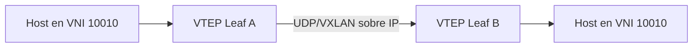

- VXLAN encapsula tráfico de segmentos lógicos sobre una red IP.
- El VNI tiene 24 bits: permite aproximadamente 16 millones de identificadores.
- EVPN puede proporcionar el plano de control para MAC, IP, VTEP y segmentos.

---

# Requisitos operativos del overlay

### Underlay

- Conectividad IP entre VTEPs
- ECMP y convergencia
- MTU suficiente para encapsulación
- Observabilidad de rutas y enlaces

### Overlay

- Segmentación mediante VNI
- Control plane EVPN cuando aplique
- Políticas de seguridad distribuidas
- Trazabilidad de MAC, IP y endpoints

---

# Actividad 5

## Plan IP e integración overlay

En grupos:

1. Propongan prefijos IPv4 e IPv6 para underlay, loopbacks y segmentos de servicio.
2. Definan rangos para gestión, web, aplicación, base de datos, respaldo y almacenamiento.
3. Identifiquen dos riesgos de solapamiento y cómo prevenirlos.
4. Expliquen qué datos deben mantenerse en IPAM.

Tiempo sugerido: 30 minutos.

---

# Cierre del bloque 5

- El direccionamiento debe facilitar agregación, operación y crecimiento.
- VXLAN aporta encapsulación y EVPN puede aportar control plane.
- IPAM, automatización y observabilidad son requisitos operativos.

---
layout: section
---

# Bloque 6

## Caso integrador y evaluación

### Duración: 2 h 30 min

---

# Caso integrador

## Diseño de un fabric inicial

Una organización requiere conectar **200 servidores dual-homed**.

### Requisitos

- Dos interfaces de 25 Gb/s por servidor
- Crecimiento del 30%
- Tolerancia a falla de un enlace Leaf–Spine
- Sobresuscripción máxima objetivo de 3:1

### Recursos

- Leaf: 48 × 25 Gb/s y 8 × 100 Gb/s
- Spine: 32 × 100 Gb/s
- Underlay: eBGP u OSPF
- Segmentos: gestión, web, app, BD, backup y storage

---

# Tareas de diseño I

1. Definir el número de leafs, spines y enlaces necesarios.
2. Calcular capacidad hacia servidores y uplinks por leaf.
3. Calcular la sobresuscripción por leaf.
4. Determinar el crecimiento posible sin modificar el número de spines.

> Expliciten supuestos de puertos, velocidades, dual-homing y reserva de capacidad.

---

# Tareas de diseño II

5. Proponer prefijos IPv4 e IPv6 para underlay, loopbacks y servicios.
6. Identificar dominios de falla físicos, eléctricos, lógicos y operativos.
7. Justificar EVPN multihoming, MLAG u otra opción de conectividad.
8. Definir métricas: pérdida, latencia, utilización, errores, convergencia, BGP y disponibilidad.

---

# Entregables

- Diagrama lógico y físico
- Tabla de puertos y capacidad
- Plan IP documentado

- Matriz de dominios de falla
- Justificación arquitectónica: máximo 1.500 palabras
- Plan de pruebas de falla y recuperación

Trabajo en clase: 60 minutos. Defensa técnica: 10–12 minutos por grupo.

---

# Rúbrica de evaluación

| Dimensión | Peso |
|---|---:|
| Corrección técnica | 25% |
| Justificación y trade-offs | 20% |
| Capacidad, escalabilidad y disponibilidad | 15% |
| Seguridad y segmentación | 15% |
| Dominios de falla y pruebas | 10% |
| Documentación y trazabilidad | 10% |
| Automatización, IPAM y observabilidad | 5% |

---

# Ideas clave

<v-clicks>

- Un centro de datos es un sistema de sistemas
- La arquitectura responde a tráfico, negocio y operación
- Spine–Leaf favorece ECMP y tráfico East–West
- VXLAN encapsula; EVPN puede controlar el overlay
- Redundancia no equivale automáticamente a disponibilidad
- IPAM, automatización y observabilidad son capacidades operativas
- Las decisiones deben declarar supuestos, riesgos y trade-offs

</v-clicks>

---

# Referencias recomendadas

- Uptime Institute — *Tier Standard: Topology*
- ANSI/TIA-942-C — *Telecommunications Infrastructure Standard for Data Centers*
- IETF RFC 7348 — *Virtual eXtensible Local Area Network (VXLAN)*
- IETF RFC 7432 — *BGP MPLS-Based Ethernet VPN*
- ISO/IEC 22237 — *Data centre facilities and infrastructures*
- ISO/IEC 27001 — *Information security management systems*
- IETF RFC 1918 — *Address Allocation for Private Internets*
- IETF RFC 4193 — *Unique Local IPv6 Unicast Addresses*

---
layout: end
---

# Pregunta de discusión

¿Qué arquitectura propondría para una organización con:

- Tráfico East–West predominante
- Crecimiento esperado del 50%
- Disponibilidad crítica
- Presupuesto limitado
- Equipo operativo pequeño

Universidad Nacional de Colombia · Redes de Datos · Unidad 1

# Unidad 2

## Implementación de Redes para Data Center

### Redes de Datos

**Especialización en Gestión de Redes de Datos**

Universidad Nacional de Colombia

Duración sugerida: 8–10 horas

---
layout: intro
---

# Propósito de la unidad

Implementar una red de data center exige integrar:

### Plano de datos

- Ethernet e IP
- Switching y routing
- Capacidad y buffers
- ECMP y convergencia

### Plano de control y operación

- VLAN, VXLAN y EVPN
- Redundancia y BFD
- Seguridad y segmentación
- Observabilidad y automatización

> Las decisiones deben justificarse mediante requisitos, evidencia, riesgos y *trade-offs*.

---

# Resultados de aprendizaje

Al finalizar la unidad, el estudiante podrá:

<v-clicks>

- Diferenciar LAN de data center y LAN de campus
- Comparar store-and-forward y cut-through
- Calcular capacidad full-duplex y sobresuscripción
- Configurar VLAN, trunks y LACP
- Explicar VXLAN, VTEP, underlay, overlay y EVPN
- Distinguir LACP, MLAG y EVPN multihoming
- Diseñar redundancia de enlaces, dispositivos, rutas y gateway
- Configurar BFD y medir convergencia

</v-clicks>

---

# Estructura de la unidad

| Bloque | Tema | Duración sugerida |
|---:|---|---:|
| 1 | LAN y switching de data center | 1 h 30 min |
| 2 | Capacidad, buffers y congestión | 1 h 30 min |
| 3 | VLAN, VRF, LACP y MLAG | 1 h 30 min |
| 4 | VXLAN, EVPN y Anycast Gateway | 2 h |
| 5 | Redundancia, BFD y convergencia | 1 h 30 min |
| 6 | Laboratorios y caso integrador | 1–2 h |

---

# Metodología

### Comprender

Conceptos, protocolos, headers y control plane.

### Implementar

Configuración guiada en laboratorio y verificación operacional.

### Evaluar

Fallas inducidas, métricas, evidencia y justificación técnica.

---
layout: section
---

# Bloque 1

## LAN y switching de data center

### Duración: 1 h 30 min

---

# Tráfico en el data center

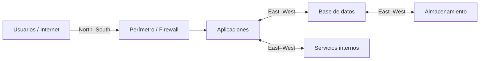

- **North–South:** usuarios, Internet, WAN y servicios externos.
- **East–West:** tráfico entre servicios, hosts y almacenamiento.

> El patrón dominante depende de la arquitectura de aplicaciones; no debe asumirse igual para todos los centros de datos.

---

# Requisitos de una LAN de data center

### Rendimiento

- Capacidad promedio y de pico
- Latencia, jitter y pérdida tolerada
- Tráfico por rack, pod y fabric
- Sobresuscripción por dominio

### Operación y resiliencia

- Escalabilidad de endpoints y rutas
- Segmentación y seguridad
- Capacidad disponible después de fallas
- Automatización, telemetría y trazabilidad

---

# Reenvío Ethernet e IP

- El switching Ethernet usa tablas MAC para reenviar frames.
- El routing IP usa tablas de rutas y entradas de forwarding.
- En fabrics modernas, leafs suelen conectar endpoints y realizar routing distribuido.
- Spines proporcionan tránsito IP de alta capacidad.

---

# Store-and-forward vs cut-through

| Método | Operación | Beneficio | Consideración |
|---|---|---|---|
| Store-and-forward | Recibe frame completo | Puede verificar FCS | Latencia depende del frame y plataforma |
| Cut-through | Reenvía antes de recibir todo el frame | Reduce latencia | Puede propagar frames corruptos |

> Los modos híbridos o adaptativos son específicos de la plataforma; verifique ASIC, software y documentación del fabricante.

---

# Actividad 1

## Perfil de tráfico y requisitos

En equipos:

1. Seleccionen una aplicación: ERP, e-commerce, IA, HPC o plataforma universitaria.
2. Estimen flujos East–West y North–South.
3. Definan requisitos de capacidad, latencia, disponibilidad y seguridad.
4. Identifiquen dos métricas para validar cada requisito.

Tiempo sugerido: 25 minutos.

---

# Cierre del bloque 1

- Las redes de data center responden a perfiles de aplicaciones, no solo a topologías.
- Capacidad, latencia, disponibilidad y seguridad deben ser requisitos medibles.
- El comportamiento de switching depende de hardware y configuración.

---
layout: section
---

# Bloque 2

## Capacidad, buffers y congestión

### Duración: 1 h 30 min

---

# Capacidad full-duplex

## Ejemplo: puertos de acceso

Un leaf tiene 48 puertos de 25 Gb/s:

\[
48\times25\times2=2400\ \text{Gb/s}
\]

**Capacidad agregada teórica full-duplex: 2,4 Tb/s.**

> Esta cifra no prueba por sí sola que el switch o la fabric sean no bloqueantes.

---

# ¿Qué significa “no bloqueo”? 

### Debe considerarse

- Capacidad de switching
- Capacidad de forwarding
- Buffers y colas
- Grupos internos de puertos
- Perfil de tráfico

### También importa

- Velocidad y cantidad de uplinks
- Encapsulación y MTU
- Hash ECMP o LAG
- Congestión y microbursts
- Capacidad posterior a falla

---

# Cálculo de sobresuscripción

Un leaf tiene:

- 48 puertos de acceso a 25 Gb/s.
- 6 uplinks a 100 Gb/s.

\[
C_{acceso}=48\times25=1200\ \text{Gb/s}
\]

\[
C_{uplinks}=6\times100=600\ \text{Gb/s}
\]

\[
\text{Sobresuscripción}=\frac{1200}{600}=2:1
\]

---

# Interpretación del resultado

Una sobresuscripción de **2:1** indica que la capacidad agregada de acceso es el doble de la capacidad agregada hacia el fabric.

### No implica necesariamente

- Un diseño incorrecto
- Pérdida constante
- Saturación permanente

### Debe contrastarse con

- Perfil real de tráfico
- Picos y microbursts
- Criticidad y SLA
- Capacidad tras fallas

---

# Buffers, microbursts e incast

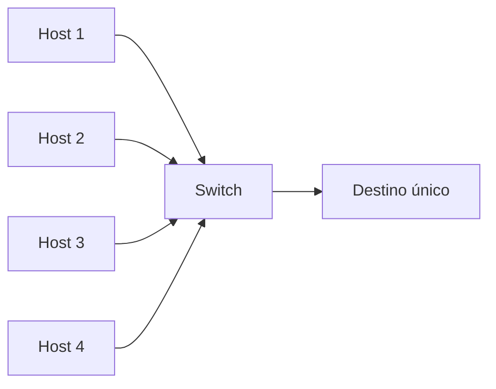

- **Microburst:** ráfaga breve que puede exceder una cola de salida.
- **Incast:** múltiples emisores transmiten hacia uno o pocos destinos.
- **Head-of-line blocking:** un flujo bloqueado puede impedir otros flujos en una cola.

---

# ECN, DCTCP y PFC

| Mecanismo | Función | Consideración principal |
|---|---|---|
| ECN | Señaliza congestión sin descartar de inmediato | Requiere soporte extremo a extremo |
| DCTCP | Ajusta TCP usando la señal ECN | Requiere hosts compatibles |
| PFC | Pausa una prioridad Ethernet específica | Puede propagar congestión y causar deadlocks |
| 802.3x PAUSE | Pausa el enlace completo | Puede bloquear clases no relacionadas |

> PFC no debe habilitarse indiscriminadamente; requiere diseño y validación cuidadosos.

---

# Actividad 2

## Diagnóstico de congestión

Un servicio distribuido experimenta pérdida durante picos de tráfico.

1. Formulen hipótesis: incast, microbursts, uplinks saturados, MTU, ECMP, buffers o QoS.
2. Propongan métricas y contadores para validar cada hipótesis.
3. Decidan cuándo usar ECN, DCTCP o PFC.
4. Identifiquen riesgos de habilitar PFC sin diseño integral.

Tiempo sugerido: 30 minutos.

---

# Cierre del bloque 2

- Capacidad nominal no equivale a desempeño garantizado.
- La sobresuscripción debe calcularse con velocidades agregadas.
- Buffers y mecanismos de congestión requieren medición, no supuestos.

---
layout: section
---

# Bloque 3

## VLAN, VRF, LACP y MLAG

### Duración: 1 h 30 min

---

# VLAN: segmentación de capa 2

Una VLAN es un dominio lógico de capa 2 definido mediante IEEE 802.1Q.

### Características

- Etiqueta 802.1Q de 4 bytes
- VID de 12 bits
- Valores operativos: 1 a 4094
- Separación de dominios broadcast

### No resuelve por sí sola

- Seguridad integral
- Puntos únicos de falla
- Escalabilidad ilimitada
- Control de acceso o microsegmentación

---

# Segmentación efectiva

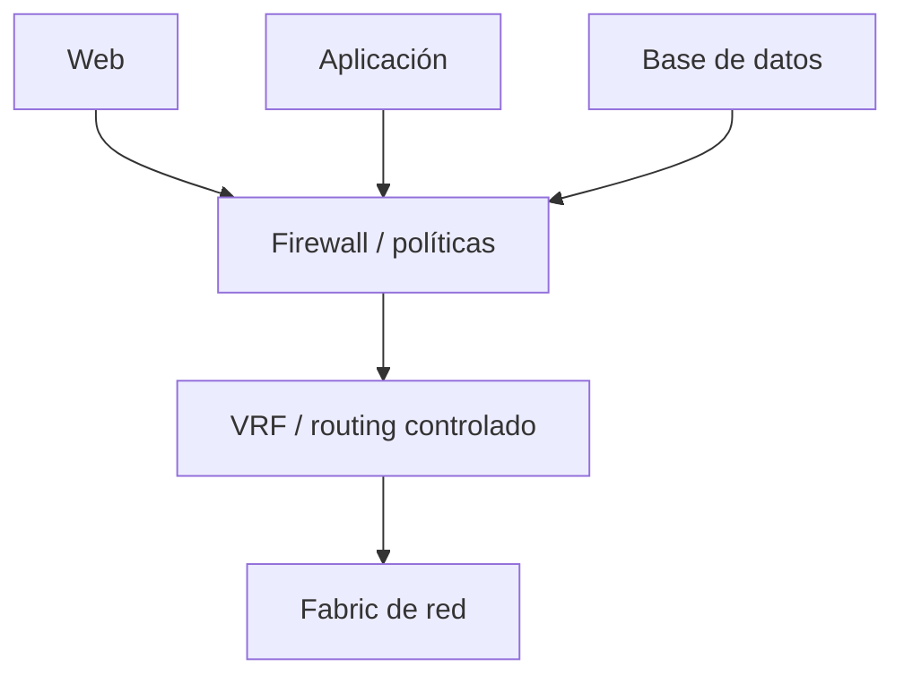

Una estrategia completa puede combinar:

- VLAN y VNI.
- VRF y routing de capa 3.
- ACL, firewalls y políticas distribuidas.
- Gestión fuera de banda, identidad, registros e IPAM.

---

# LAG y LACP

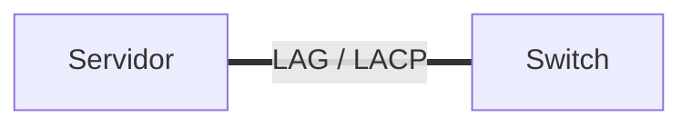

- IEEE 802.1AX define Link Aggregation y LACP.
- Un LAG combina enlaces físicos como una interfaz lógica.
- Mejora capacidad agregada y tolerancia a fallas de enlace.
- La distribución usa hashing: un flujo único no suele usar toda la capacidad del LAG.

---

# MLAG y EVPN multihoming

| Tecnología | Objetivo | Consideraciones |
|---|---|---|
| LACP | Agregación de enlaces | Normalmente termina en un sistema lógico |
| MLAG / vPC / MC-LAG | Endpoint conectado a dos switches físicos | Estado sincronizado, peer-link, split-brain |
| EVPN multihoming | Coordinación de endpoint multihomed mediante ESI | Estándar, plataforma y modo deben validarse |

> EVPN multihoming y LACP pueden coexistir hacia el endpoint.

---

# Actividad 3

## Selección de multihoming

Para un servidor crítico dual-homed:

1. Comparen LACP a un switch, MLAG y EVPN multihoming.
2. Analicen disponibilidad, interoperabilidad, complejidad y dominios de falla.
3. Expliquen qué dependencias adicionales introduce cada alternativa.
4. Propongan comandos de verificación para la plataforma elegida.

Tiempo sugerido: 30 minutos.

---

# Cierre del bloque 3

- VLAN es segmentación de capa 2, no una estrategia completa de seguridad.
- LACP agrega enlaces; su distribución depende del hashing.
- MLAG y EVPN multihoming resuelven problemas similares con arquitecturas distintas.

---
layout: section
---

# Bloque 4

## VXLAN, EVPN y gateway distribuido

### Duración: 2 horas

---

# VXLAN: encapsulamiento overlay

VXLAN transporta frames Ethernet sobre una red IP mediante UDP.

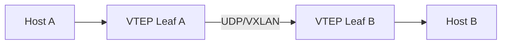

- VTEP encapsula y desencapsula tráfico VXLAN.
- VNI de 24 bits: hasta \(2^{24}\) valores posibles.
- Puerto UDP de destino habitual: 4789.

---

# Paquete VXLAN

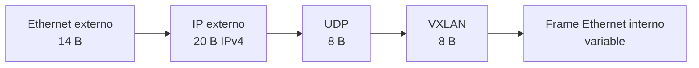

El diseño debe validar MTU suficiente, reachability entre VTEPs, ECMP, políticas de firewall y visibilidad de tráfico encapsulado.

---

# Underlay y overlay

## Underlay

Red IP física entre switches y VTEPs.

- eBGP, OSPF o IS-IS
- ECMP y convergencia
- Enlaces punto a punto
- Loopbacks y reachability

## Overlay

Red lógica construida sobre el underlay.

- VXLAN y VNI
- VRF y tenants
- Segmentos L2/L3
- Movilidad y políticas

---

# EVPN como control plane

EVPN usa BGP para distribuir información de alcanzabilidad Ethernet e IP.

| Ruta | Nombre | Uso principal |
|---:|---|---|
| 1 | Ethernet Auto-Discovery | Señalización de segmentos y multihoming |
| 2 | MAC/IP Advertisement | MAC, IP y ubicación de endpoint |
| 3 | Inclusive Multicast Ethernet Tag | Distribución BUM |
| 4 | Ethernet Segment | ESI y elección de DF |
| 5 | IP Prefix | Prefijos IP; definido por RFC 9136 |

---

# EVPN y tráfico BUM

EVPN reduce la dependencia de aprendizaje por inundación, pero **no elimina automáticamente** todo tráfico BUM.

### BUM

- Broadcast
- Unknown unicast
- Multicast

### Modelos frecuentes

- Ingress replication
- Multicast en underlay
- Optimización dependiente de plataforma

---

# Anycast Gateway

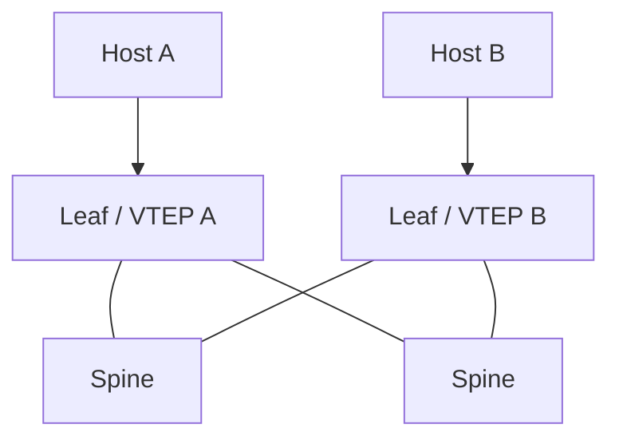

Un gateway distribuido permite que el host use el leaf local para routing hacia otros segmentos.

> Requiere consistencia de identidad IP/MAC, control plane, políticas y comportamiento validado para la plataforma.

---

# Actividad 4

## Diseño VXLAN-EVPN

En equipos:

1. Propongan dos VNIs y una VRF para web y aplicación.
2. Definan loopbacks de VTEP y prefijos de underlay.
3. Indiquen qué rutas EVPN son relevantes.
4. Expliquen cómo distribuirían BUM.
5. Identifiquen riesgos de una MTU insuficiente.

Tiempo sugerido: 35 minutos.

---

# Cierre del bloque 4

- VXLAN proporciona encapsulamiento de overlay sobre IP.
- EVPN aporta un control plane basado en BGP.
- Underlay, overlay y gateway distribuido deben diseñarse como un sistema integrado.

---
layout: section
---

# Bloque 5

## Redundancia, BFD y convergencia

### Duración: 1 h 30 min

---

# Redundancia y fallas comunes

### Redundancia de red

- LAG y enlaces diversos
- ECMP y múltiples spines
- Dual-homing de endpoints
- Gateway distribuido

### Fallas de modo común

- Ducto o fuente eléctrica compartida
- Error de automatización
- Versión defectuosa de software
- DNS, NTP, AAA o control compartido

> Dos enlaces o dos switches no garantizan independencia si comparten un mismo dominio de falla.

---

# VRRP, HSRP y Anycast Gateway

| Mecanismo | Contexto principal | Naturaleza |
|---|---|---|
| VRRP | Gateway redundante tradicional | Estándar IETF |
| HSRP | Gateway redundante tradicional | Propietario Cisco |
| Anycast Gateway | Fabric distribuido VXLAN-EVPN | Depende de diseño y plataforma |

La selección depende de topología, movilidad, integración heredada y requisitos de operación.

---

# BFD: detección rápida

BFD detecta fallas de forwarding bidireccional entre sistemas.

\[
T_{detección}\approx \text{intervalo efectivo}\times\text{detect multiplier}
\]

Ejemplo ilustrativo:

\[
50\ \text{ms}\times3\approx150\ \text{ms}
\]

> El resultado real depende de negociación, hardware, modo BFD, temporizadores y carga del sistema.

---

# Detección no es convergencia

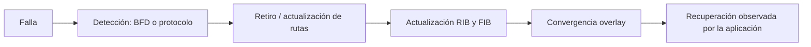

La recuperación extremo a extremo debe medirse con tráfico, telemetría y pruebas de falla.

---

# Plan de pruebas de convergencia

Para cada escenario registre:

- Falla inducida y hora exacta.
- Estado previo y posterior de BGP, OSPF, IS-IS o EVPN.
- Configuración BFD y temporizadores.
- Pérdida, latencia, jitter, errores y drops.
- Actualizaciones RIB/FIB y capacidad remanente.
- Impacto funcional sobre la aplicación.

---

# Actividad 5

## Diseño de una prueba de falla

Diseñen un experimento para medir recuperación tras perder un enlace Leaf–Spine:

1. Definan topología y ruta esperada de respaldo.
2. Definan tráfico de prueba y métricas.
3. Midan con y sin BFD.
4. Expliquen qué eventos deben verificarse en control plane y data plane.
5. Determinen criterios de aceptación.

Tiempo sugerido: 30 minutos.

---

# Cierre del bloque 5

- La redundancia debe evaluarse frente a dominios de falla compartidos.
- BFD acelera detección, pero no garantiza convergencia total.
- La resiliencia debe demostrarse con pruebas reproducibles.

---
layout: section
---

# Bloque 6

## Laboratorios y caso integrador

### Duración: 1–2 horas

---

# Laboratorios propuestos

| Lab | Tema | Evidencia esperada |
|---:|---|---|
| 1 | VLAN, trunking y LACP | VLANs, trunks, LAG y tablas MAC verificadas |
| 2 | Underlay Spine–Leaf | Vecinos de routing, loopbacks y ECMP |
| 3 | VXLAN-EVPN | VTEPs, VNIs, rutas EVPN y Anycast Gateway |
| 4 | BFD y fallas | Medición de detección, pérdida y recuperación |

> Herramientas sugeridas: Containerlab, EVE-NG, GNS3, CML o plataformas virtuales compatibles.

---

# Caso integrador

## Diseño de un fabric inicial

Una organización requiere conectar **200 servidores dual-homed**.

### Requisitos

- Dos interfaces de 25 Gb/s por servidor
- Crecimiento del 30%
- Tolerancia a falla Leaf–Spine
- Sobresuscripción objetivo máxima de 3:1

### Recursos

- Leaf: 48 × 25 Gb/s y 8 × 100 Gb/s
- Spine: 32 × 100 Gb/s
- Underlay: eBGP, OSPF o IS-IS
- Overlay: VXLAN con EVPN

---

# Tareas del caso I

1. Declare supuestos de dual-homing, puertos, crecimiento y reserva de capacidad.
2. Determine número de leafs, spines y enlaces.
3. Calcule capacidad de acceso, uplinks y sobresuscripción.
4. Evalúe capacidad restante después de perder un spine o enlace Leaf–Spine.
5. Diseñe prefijos IPv4 e IPv6 para underlay, loopbacks, VRFs y servicios.

---

# Tareas del caso II

6. Defina VLAN, VNI, VRF y políticas de segmentación.
7. Justifique MLAG, EVPN multihoming u otra alternativa.
8. Diseñe Anycast Gateway y estrategia BFD.
9. Identifique dominios de falla físicos, eléctricos, lógicos y operativos.
10. Defina métricas de observabilidad y un plan de pruebas de aceptación.

---

# Entregables

- Diagrama físico y lógico
- Tabla de interfaces, velocidades y capacidad
- Cálculos normales y posteriores a fallas
- Plan IPv4/IPv6

- Tabla de VLAN, VNI, VRF y políticas
- Matriz de dominios de falla
- Plan de pruebas y criterios de aceptación
- Informe técnico: máximo 1.500 palabras

---

# Rúbrica de evaluación

| Criterio | Peso |
|---|---:|
| Corrección técnica | 25% |
| Justificación y trade-offs | 20% |
| Capacidad y análisis posterior a falla | 15% |
| Segmentación y seguridad | 15% |
| Configuración, verificación y troubleshooting | 10% |
| Documentación y trazabilidad | 10% |
| Observabilidad y automatización | 5% |

---

# Ideas clave

<v-clicks>

- Las redes de data center deben partir de requisitos medibles
- Switching, capacidad y buffers determinan el comportamiento ante congestión
- VLAN no reemplaza segmentación y seguridad de extremo a extremo
- VXLAN encapsula; EVPN proporciona control plane
- MLAG y EVPN multihoming tienen arquitecturas y riesgos distintos
- BFD acelera detección, no garantiza recuperación completa
- La resiliencia debe verificarse mediante fallas inducidas y métricas

</v-clicks>

---

# Referencias recomendadas

- IETF RFC 7348 — *Virtual eXtensible Local Area Network (VXLAN)*
- IETF RFC 7432 — *BGP MPLS-Based Ethernet VPN*
- IETF RFC 9135 — *Integrated Routing and Bridging in EVPN*
- IETF RFC 9136 — *IP Prefix Advertisement in EVPN*
- IETF RFC 5880 — *Bidirectional Forwarding Detection*
- IETF RFC 5798 — *Virtual Router Redundancy Protocol Version 3*
- IEEE 802.1Q — *Bridges and Bridged Networks*
- IEEE 802.1AX — *Link Aggregation*
- IEEE 802.1Qbb — *Priority-based Flow Control*

---
layout: end
---

# Pregunta de cierre

¿Cómo justificaría una arquitectura de data center para una organización con:

- Tráfico East–West creciente
- Aplicaciones críticas y otras no críticas
- Presupuesto limitado
- Equipo operativo pequeño
- Necesidad de evolución hacia automatización y observabilidad

Universidad Nacional de Colombia · Redes de Datos · Unidad 2

