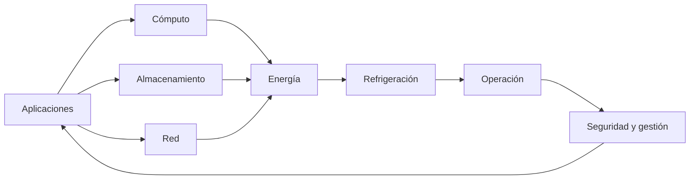
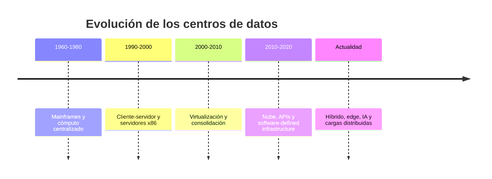
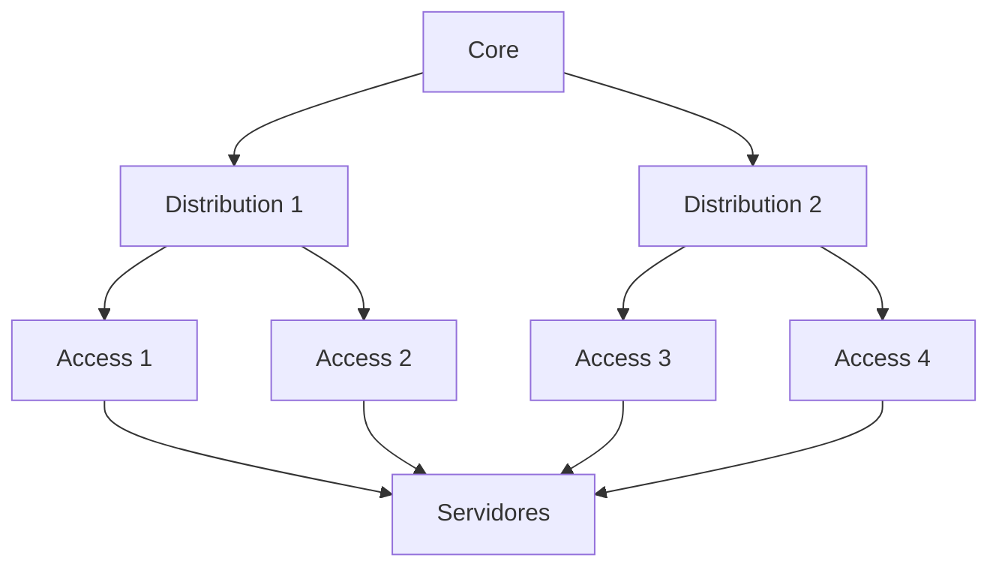
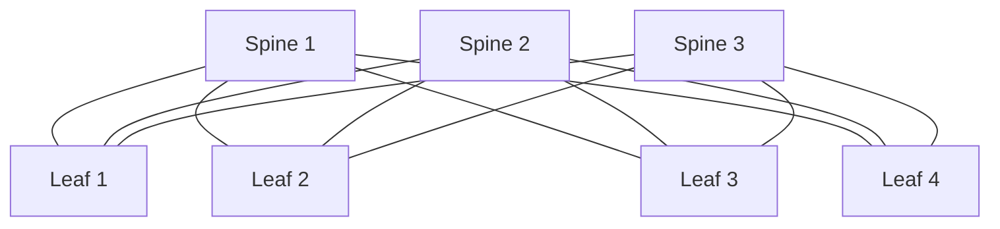
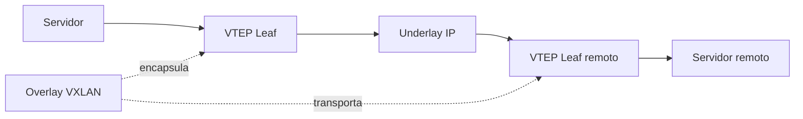
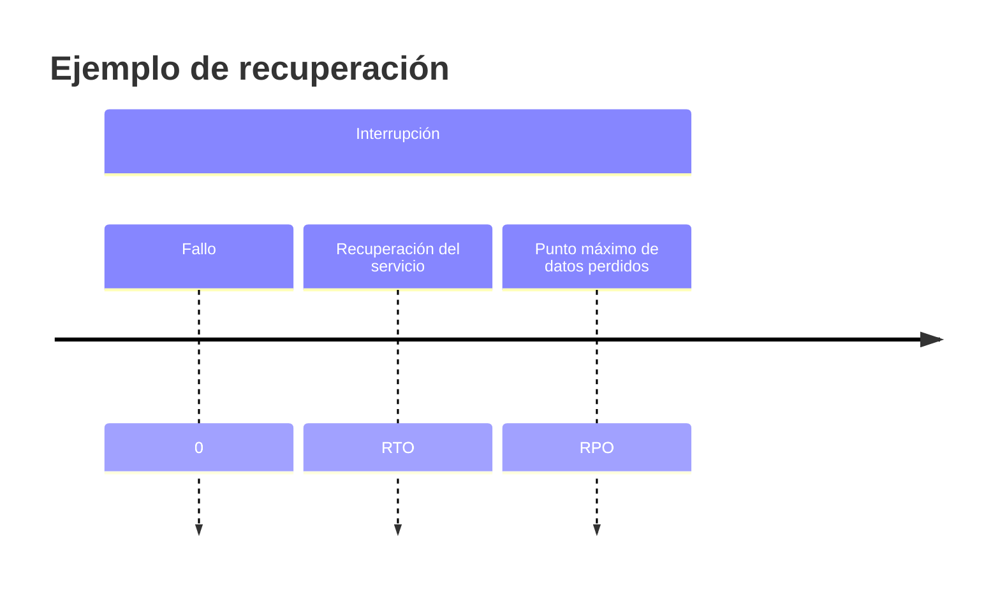

# Fundamentos y Diseño de Data Center

## Unidad 1

### Redes de Datos

**Especialización en Gestión de Redes de Datos**

Universidad Nacional de Colombia

Material académico para 10 horas

---

## layout: intro

# Estructura del curso

| Sesión | Duración  | Tema principal               |
| ------ | --------- | ---------------------------- |
| 1      | 1h 45 min | Evolución y componentes      |
| 2      | 1h 45 min | Arquitecturas de red         |
| 3      | 1h 45 min | Capacidad y sobresuscripción |
| 4      | 1h 45 min | Estándares y disponibilidad  |
| 5      | 1h 45 min | Direccionamiento y VXLAN     |
| 6      | 1h 15 min | Caso integrador y evaluación |

<v-click>

> Total: 10 horas distribuidas en 6 sesiones.

</v-click>

---

# Resultados de aprendizaje

Al finalizar el estudiante podrá:

<v-clicks>

- Explicar la evolución de los centros de datos.
- Diferenciar cómputo, red, almacenamiento e infraestructura física.
- Comparar arquitecturas de tres capas y Spine–Leaf.
- Calcular sobresuscripción y disponibilidad.
- Distinguir estándares, clasificaciones y certificaciones.
- Identificar dominios de falla.
- Diseñar direccionamiento IP escalable.
- Explicar underlay, overlay, VXLAN, VTEP y EVPN.

</v-clicks>

---

# Metodología de trabajo

- Exposición guiada.
- Análisis de casos reales.
- Talleres cuantitativos.
- Diseño de arquitecturas.
- Discusión crítica.
- Evaluación continua.

<v-click>

> Cada sesión incluye: introducción, desarrollo, actividad práctica y cierre.

</v-click>

---

# Evaluación

- Corrección técnica: 25%.
- Justificación arquitectónica y análisis de trade-offs: 20%.
- Capacidad, escalabilidad y disponibilidad: 15%.
- Seguridad y segmentación: 15%.
- Identificación de dominios de falla y plan de pruebas: 10%.
- Calidad de documentación, diagramas y trazabilidad: 10%.
- Uso apropiado de automatización, IPAM y observabilidad: 5%.

---

## layout: section

# Sesión 1

## Evolución y componentes

### Duración: 1h 45 min

---

# Agenda Sesión 1

- Introducción y contexto.
- Evolución histórica de los centros de datos.
- Componentes principales.
- Actividad práctica.
- Cierre y preguntas.

---

# El centro de datos como sistema

La calidad del servicio depende de la interacción entre múltiples dominios.

---

# Evolución histórica

---

# De la centralización a la nube

| Etapa            | Característica principal            | Reto dominante                   |
| ---------------- | ----------------------------------- | -------------------------------- |
| Mainframe        | Escalabilidad vertical              | Alto costo y dependencia central |
| Cliente-servidor | Distribución de aplicaciones        | Server sprawl                    |
| Virtualización   | Consolidación de recursos           | Sobreconsolidación               |
| Nube             | Aprovisionamiento mediante software | Gobierno y dependencia           |
| Híbrido/edge/IA  | Cargas distribuidas                 | Latencia, energía y operación    |

---

# Componentes principales

<h3> Cómputo</h3>

- Rack.
- Blade.
- Hiperconvergencia.
- GPU, DPU y aceleradores.

<h3> Red</h3>

- Leaf y spine.
- Firewalls.
- Balanceadores.
- WAN e Internet.

<h3> Almacenamiento</h3>

- SAN.
- NAS.
- Object storage.
- NVMe over Fabrics.

<h3> Infraestructura</h3>

- Energía.
- Refrigeración.
- Racks.
- Cableado y seguridad física.

---

# Actividad práctica 1

## Análisis de un centro de datos real

En grupos de 3–4 personas:

1. Describan un centro de datos conocido.
2. Identifiquen cómputo, red, almacenamiento e infraestructura.
3. Clasifiquen la etapa evolutiva predominante.
4. Identifiquen dos riesgos operativos.

**Duración:** 20 minutos.

---

# Cierre Sesión 1

- El centro de datos es un sistema de sistemas.
- La evolución responde a capacidad, disponibilidad, flexibilidad y costo.
- Los componentes deben diseñarse de forma integrada.

**Pregunta de reflexión:**
¿Qué condiciones justificarían mantener una carga en una instalación propia en lugar de migrarla a nube pública?

---

## layout: section

# Sesión 2

## Arquitecturas de red

### Duración: 1h 45 min

---

# Agenda Sesión 2

- Arquitectura jerárquica de tres capas.
- Arquitectura Spine–Leaf.
- Underlay y overlay.
- Actividad práctica.
- Cierre.

---

# Arquitectura jerárquica de tres capas

## Capas

- **Acceso:** conexión de equipos finales.
- **Distribución:** agregación, políticas y routing.
- **Núcleo:** conectividad de alta capacidad.

---

# Arquitectura Spine–Leaf

Cada leaf se conecta con cada spine.

<v-clicks>

- Caminos predecibles.
- ECMP en capa 3.
- Escalamiento horizontal.
- Mejor adaptación al tráfico East–West.

</v-clicks>

---

# Comparación de arquitecturas

| Criterio      | Tres capas                    | Spine–Leaf                           |
| ------------- | ----------------------------- | ------------------------------------ |
| Modelo        | Acceso, distribución y núcleo | Leaf y spine                         |
| Tráfico ideal | North–South                   | East–West                            |
| Multipath     | Depende del diseño            | ECMP nativo en el underlay           |
| Escalabilidad | Vertical y jerárquica         | Horizontal                           |
| Latencia      | Puede variar por capa         | Saltos más predecibles               |
| Operación     | Familiar en redes heredadas   | Requiere automatización y routing IP |

---

# Underlay y overlay

## Underlay

Red IP física que conecta los dispositivos de red.

## Overlay

Red lógica construida sobre el underlay.

## VTEP

Punto que encapsula y desencapsula tráfico VXLAN.

---

# Actividad práctica 2

## Diseño comparativo 3-tier vs Spine–Leaf

En grupos:

1. Diseñen una arquitectura de tres capas para 100 servidores.
2. Diseñen un fabric Spine–Leaf para 100 servidores.
3. Comparen saltos, capacidad y operación.
4. Identifiquen dos dominios de falla en cada diseño.

**Duración:** 25 minutos.

---

# Cierre Sesión 2

- Spine–Leaf favorece escalabilidad y tráfico East–West.
- Underlay y overlay separan planos físico y lógico.
- La arquitectura debe responder al perfil de tráfico.

---

## layout: section

# Sesión 3

## Capacidad y sobresuscripción

### Duración: 1h 45 min

---

# Agenda Sesión 3

- Cálculo de capacidad.
- Sobresuscripción.
- Ejercicios cuantitativos.
- Actividad práctica.
- Cierre.

---

# Cálculo de capacidad

## Ejemplo

Un leaf tiene:

- 44 puertos de servidor de 25 Gb/s.
- 4 uplinks de 100 Gb/s.

$$
\text{Capacidad de servidores}
= 44 \times 25
= 1100\ \text{Gb/s}
$$

$$
\text{Capacidad de uplinks}
= 4 \times 100
= 400\ \text{Gb/s}
$$

---

# Sobresuscripción

$$
\text{Sobresuscripción}
= \frac{\text{capacidad agregada hacia servidores}}{\text{capacidad agregada de uplinks}}
$$

## Ejemplo

$$
\text{Sobresuscripción}
= \frac{1100}{400}
= 2.75:1
$$

La relación aceptable depende del perfil de tráfico, los picos, la criticidad y los SLA.

---

# Taller cuantitativo

## Ejercicio 1

Calcule la sobresuscripción de un leaf con:

- 32 puertos de 25 Gb/s.
- 4 uplinks de 100 Gb/s.

## Ejercicio 2

Un leaf tiene:

- 48 puertos de 10 Gb/s.
- 4 uplinks de 40 Gb/s.

Calcule la sobresuscripción.

**Duración:** 15 minutos.

---

# Actividad práctica 3

## Escenarios de capacidad

En grupos:

1. Diseñen un leaf para 200 servidores de 25 Gb/s dual-homed.
2. Propongan número de spines y enlaces.
3. Calculen sobresuscripción.
4. Determinen crecimiento máximo sin modificar spines.

**Duración:** 30 minutos.

---

# Cierre Sesión 3

- La sobresuscripción debe calcularse con capacidad, no solo con número de puertos.
- El resultado aceptable depende del tráfico y la criticidad.
- El diseño debe explicitar supuestos y márgenes de crecimiento.

---

## layout: section

# Sesión 4

## Estándares y disponibilidad

### Duración: 1h 45 min

---

# Agenda Sesión 4

- Estándares, clasificaciones y certificaciones.
- Uptime Institute Tier Standard.
- ANSI/TIA-942-C.
- Disponibilidad y modelos de redundancia.
- Actividad práctica.
- Cierre.

---

# Estándares y clasificaciones

| Concepto              | Naturaleza                | Propósito                       |
| --------------------- | ------------------------- | ------------------------------- |
| ANSI/TIA-942          | Estándar técnico          | Requisitos de infraestructura   |
| TIA-942 Rating        | Clasificación             | Niveles de infraestructura      |
| Certificación TIA-942 | Evaluación                | Verificar conformidad           |
| Uptime Tier           | Clasificación propietaria | Topología y tolerancia a fallas |
| ISO/IEC 27001         | Sistema de gestión        | Seguridad de la información     |
| ITIL                  | Marco de prácticas        | Gestión de servicios TI         |

No debe asumirse equivalencia automática entre Rating TIA-942 y Tier de Uptime Institute.

---

# Uptime Institute Tier Standard

| Tier     | Descripción general                         |
| -------- | ------------------------------------------- |
| Tier I   | Infraestructura básica                      |
| Tier II  | Componentes redundantes                     |
| Tier III | Infraestructura mantenible concurrentemente |
| Tier IV  | Infraestructura tolerante a fallas          |

Un Tier no es garantía de disponibilidad de extremo a extremo.

---

# Disponibilidad

La disponibilidad simplificada de un componente reparable es:

$$
A = \frac{MTBF}{MTBF + MTTR}
$$

## Ejemplo

Con:

- MTBF = 8.760 horas.
- MTTR = 4 horas.

$$
A = \frac{8760}{8760 + 4}
= 0.999543
$$

Disponibilidad aproximada: **99,9543%**.

---

# Modelos de redundancia

| Modelo | Descripción                                     |
| ------ | ----------------------------------------------- |
| N      | Capacidad mínima requerida                      |
| N+1    | Capacidad mínima más una unidad adicional       |
| 2N     | Dos sistemas independientes con capacidad total |
| 2N+1   | Dos sistemas completos más capacidad adicional  |

La selección depende de impacto al negocio, costo, mantenimiento, operación y riesgo residual.

---

# Dominios de falla

## Físicos

Rack, fila, sala, edificio o zona geográfica.

## Eléctricos y mecánicos

PDU, UPS, generador, circuito, chiller o unidad CRAH/CRAC.

## Lógicos

Switch, VTEP, VLAN/VNI, controlador, clúster o DNS.

## Operativos

Procedimientos, credenciales, automatización, software o error humano.

<v-click>

La redundancia no elimina los fallos de modo común.

</v-click>

---

# RTO y RPO

## RTO

Tiempo máximo objetivo para restaurar un servicio.

## RPO

Máxima pérdida de datos aceptable expresada como tiempo.

Estos objetivos deben originarse en un **Análisis de Impacto al Negocio**, no en una tabla genérica.

---

# Actividad práctica 4

## Análisis crítico de TIA-942, Tier, N+1, 2N, RTO y RPO

En grupos:

1. Comparen un centro de datos Tier III y un Rated-3.
2. Analicen N+1 vs 2N para una carga crítica.
3. Propongan RTO y RPO para:
   - Pagos o transacciones críticas.
   - ERP corporativo.
   - Portal interno.
   - Archivo histórico.

**Duración:** 30 minutos.

---

# Cierre Sesión 4

- Estándares, clasificaciones y certificaciones no son equivalentes.
- La disponibilidad depende de infraestructura, operación y software.
- RTO y RPO deben derivarse del impacto al negocio.

---

## layout: section

# Sesión 5

## Direccionamiento y VXLAN

### Duración: 1h 45 min

---

# Agenda Sesión 5

- Principios de diseño de direccionamiento IP.
- Convenciones de host.
- VXLAN y direccionamiento.
- Actividad práctica.
- Cierre.

---

# Principios de direccionamiento IP

Un plan de direccionamiento para un centro de datos debe facilitar:

<v-clicks>

- Agregación de rutas y escalabilidad.
- Separación por función, entorno, tenant, dominio de seguridad o zona.
- Identificación operativa sin depender de convenciones frágiles.
- Integración con DNS, DHCP, IPAM, automatización y monitoreo.
- Crecimiento planificado y control de solapamientos.
- Soporte para IPv4 e IPv6 cuando aplique.

</v-clicks>

La fuente de verdad debe ser un sistema IPAM o CMDB bien gobernado.

---

# Convenciones de host

Para una red IPv4 `/24` podría utilizarse:

| Rango       | Uso convencional posible                      |
| ----------- | --------------------------------------------- |
| `.1`        | Gateway virtual o interfaz de gateway         |
| `.2–.9`     | Infraestructura de red o servicios reservados |
| `.10–.49`   | Servidores de aplicación                      |
| `.50–.99`   | Rango DHCP o asignaciones dinámicas           |
| `.100–.109` | Direcciones virtuales de servicios            |
| `.110–.200` | Hosts estáticos o reservas documentadas       |

La dirección de broadcast depende de la máscara o prefijo.

---

# VXLAN y direccionamiento

VXLAN permite transportar segmentos virtuales sobre una red IP. El encabezado VXLAN contiene un identificador VNI de 24 bits, que permite aproximadamente 16 millones de identificadores de red virtual.

El underlay utiliza direcciones IP enrutable entre VTEPs. El overlay proporciona segmentación lógica y movilidad de cargas, pero sigue dependiendo de MTU suficiente, conectividad IP del underlay, control plane, seguridad, observabilidad y diseño de capacidad.

---

# Actividad práctica 5

## Diseño de IPAM, underlay/overlay y segmentación

En grupos:

1. Diseñen un esquema de prefijos IPv4 e IPv6 para:
   - Underlay.
   - Loopbacks.
   - Segmentos de servicios.
2. Propongan rangos para:
   - Gestión.
   - Web.
   - Aplicación.
   - Base de datos.
   - Respaldo.
   - Almacenamiento.
3. Identifiquen dos riesgos de solapamiento.

**Duración:** 30 minutos.

---

# Cierre Sesión 5

- El direccionamiento debe facilitar agregación, operación y crecimiento.
- VXLAN permite segmentación y movilidad lógica.
- IPAM, automatización y observabilidad son componentes operativos.

---

## layout: section

# Sesión 6

## Caso integrador y evaluación

### Duración: 1h 15 min

---

# Agenda Sesión 6

- Presentación del caso integrador.
- Trabajo en equipos.
- Defensa técnica.
- Evaluación y cierre del curso.

---

# Caso integrador: diseño de un fabric inicial

## Requerimiento

Una organización necesita conectar **200 servidores dual-homed**.

Cada servidor requiere:

- 2 interfaces de 25 Gb/s.
- Crecimiento del 30%.
- Tolerancia a la falla de un enlace Leaf–Spine.
- Sobresuscripción objetivo máxima de 3:1.

## Recursos disponibles

- Leafs: 48 × 25 Gb/s y 8 × 100 Gb/s.
- Spines: 32 × 100 Gb/s.
- Underlay: eBGP u OSPF.
- Segmentos: gestión, web, aplicación, base de datos, respaldo y almacenamiento.

---

# Tareas de diseño

1. Diseñar el número de leafs, spines y enlaces requeridos.
2. Calcular la capacidad de servidor y uplink por leaf.
3. Calcular la sobresuscripción por leaf.
4. Determinar la capacidad máxima de crecimiento sin modificar el número de spines.
5. Proponer un esquema de prefijos IPv4 e IPv6 para underlay, loopbacks y segmentos de servicios.
6. Identificar dominios de falla físicos, eléctricos, de red y operativos.
7. Justificar si se requiere EVPN multihoming, MLAG o un modelo de conectividad alternativo.
8. Definir métricas de observabilidad: pérdida, latencia, utilización, errores, convergencia, disponibilidad y estado de BGP.

---

# Entregables

- Diagrama lógico y físico.
- Tabla de puertos y capacidad.
- Plan IP documentado.
- Matriz de dominios de falla.
- Justificación arquitectónica de máximo 1.500 palabras.
- Plan de pruebas de falla y recuperación.

**Duración del trabajo en clase:** 30 minutos.

---

# Defensa técnica

Cada grupo presenta:

- Arquitectura propuesta.
- Cálculos de capacidad y sobresuscripción.
- Plan IP.
- Dominios de falla.
- Justificación de decisiones.

**Duración por grupo:** 5–7 minutos.

---

# Evaluación del curso

- Corrección técnica: 25%.
- Justificación arquitectónica y análisis de trade-offs: 20%.
- Capacidad, escalabilidad y disponibilidad: 15%.
- Seguridad y segmentación: 15%.
- Identificación de dominios de falla y plan de pruebas: 10%.
- Calidad de documentación, diagramas y trazabilidad: 10%.
- Uso apropiado de automatización, IPAM y observabilidad: 5%.

---

# Cierre del curso

## Ideas clave

<v-clicks>

- Un centro de datos es un sistema de sistemas.
- La arquitectura debe responder al perfil de tráfico y al negocio.
- Spine–Leaf favorece escalabilidad y tráfico East–West.
- VXLAN proporciona encapsulamiento; EVPN aporta control.
- Redundancia no equivale automáticamente a disponibilidad.
- IPAM, automatización y observabilidad son componentes operativos.
- Toda decisión debe explicitar supuestos, riesgos y trade-offs.

</v-clicks>

---

# Referencias recomendadas

- Uptime Institute — _Tier Standard: Topology_.
- ANSI/TIA-942-C — _Telecommunications Infrastructure Standard for Data Centers_.
- IETF RFC 7348 — VXLAN.
- IETF RFC 7432 — BGP Ethernet VPN.
- ISO/IEC 22237 — Data centre facilities and infrastructures.
- ISO/IEC 27001 — Information security management systems.
- IETF RFC 1918 — Private IPv4 addresses.
- IETF RFC 4193 — Unique Local IPv6 Unicast Addresses.
- Guías de diseño Cisco VXLAN BGP EVPN.
- Publicaciones técnicas de Uptime Institute.

---

# Preguntas finales

## Discusión

¿Qué arquitectura propondría para una organización con:

- Tráfico East–West predominante.
- Crecimiento esperado del 50%.
- Requisito de disponibilidad crítica.
- Presupuesto limitado.
- Equipo operativo pequeño?

### Universidad Tecnológica de Pereira

**Redes de Datos — Unidad 1 — 10 horas**
